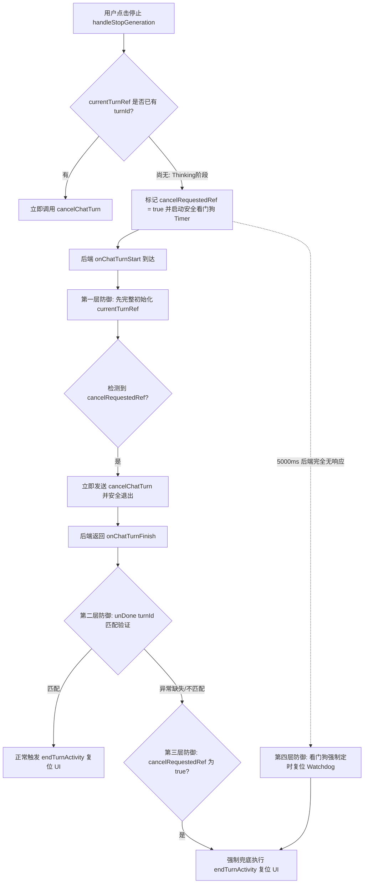
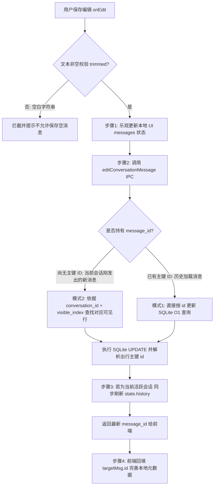
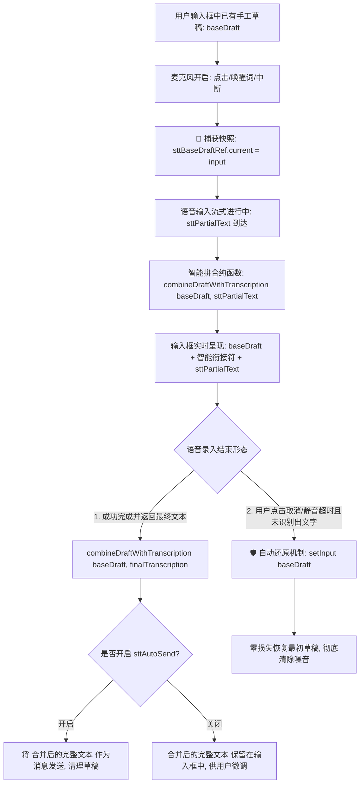
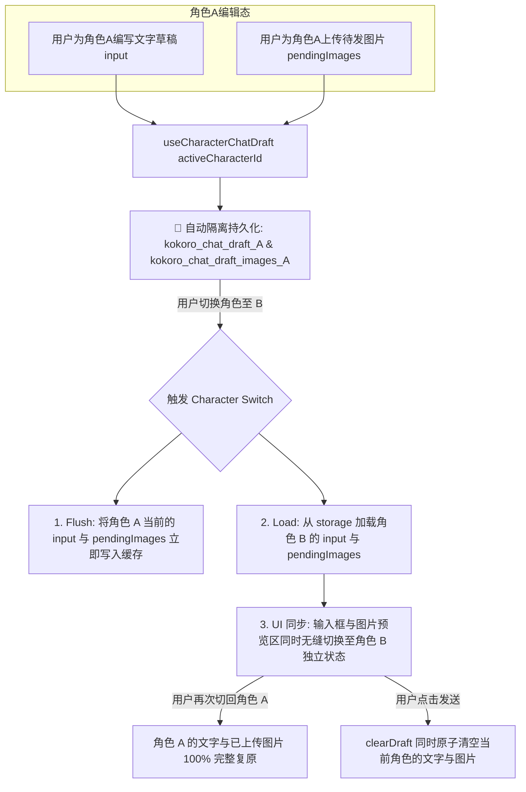

# 缺陷修复方案一：重新生成 (onRegenerate) 引发数据库重复插入与上下文污染

- **问题级别**：P0 严重功能缺陷（数据一致性与 LLM 上下文污染）
- **涉及模块**：
  - 前端对话交互组件：[`src/ui/widgets/ChatPanel.tsx`](file:///d:/Kokoro-Engine/src/ui/widgets/ChatPanel.tsx#L1335-L1379)
  - 前后端 IPC 桥接契约：[`src/lib/kokoro-bridge.ts`](file:///d:/Kokoro-Engine/src/lib/kokoro-bridge.ts#L270-L286)
  - 后端对话核心指令：[`src-tauri/src/commands/chat.rs`](file:///d:/Kokoro-Engine/src-tauri/src/commands/chat.rs#L496-L514) 与 [`L1200-L1233`](file:///d:/Kokoro-Engine/src-tauri/src/commands/chat.rs#L1200-L1233)
- **审查机制**：主审架构设计 + 独立子 Agent 对抗性推演与边界复审（Double-check Verification）

---

## 一、 缺陷根本原因深度定位

### 1. 当前执行时序与数据流断层
在用户对某条助理回复点击“重新生成”（Regenerate / Retry）时，前端与后端的时序如下：
1. 前端定位到该助理回复对应的上一条用户提问 `userMsg`（位于 `userMsgIndex`）。
2. 前端计算需要删除的消息数量：
   ```ts
   // 当前代码：ChatPanel.tsx:L1343
   const messagesToDelete = msgs.length - globalIndex;
   await deleteLastMessages(messagesToDelete);
   ```
   - 若重新生成最后一条助理回复，`messagesToDelete` 为 `1`。
   - `deleteLastMessages(1)` 从 SQLite 数据库 `conversation_messages` 和内存 `state.history` 中删除了**该条助理回复**。
   - **此时数据库和 `state.history` 的末尾正是那条原本的用户提问 `userMsg`**。
3. 前端调用 `streamChat({ message: userMsg.text, images: userMsg.images, ... })`。
4. 后端 `commands/chat.rs` 接收到普通的 `ChatRequest`：
   ```rust
   // commands/chat.rs:L1201-L1214
   if !request.hidden {
       state
           .add_message_with_metadata(
               "user".to_string(),
               request.message.clone(),
               None,
               &char_id,
               Some(system_provider.clone()),
           )
           .await;
   }
   ```
   - 因为 `request.hidden` 默认为 `false`，后端**无差别地将 `userMsg.text` 再次插入了数据库和 `history`**！
5. 前端在发起调用时执行了 `setMessages(prev => prev.slice(0, globalIndex))`，UI 上仅保留了 1 条用户提问气泡，等待新助理回复。

### 2. 产生的破坏性后果
- **持久化重复**：数据库中连续存入了两条内容完全相同的用户提问（`User: Q` $\to$ `User: Q` $\to$ `Assistant: A`）。
- **上下文膨胀与污染**：`compose_prompt_with_guard` 读取 `self.history` 构建 Prompt 时，给大模型发送了重复的用户消息，浪费 Token 并干扰模型的意图理解。
- **重新激活/刷新状态撕裂**：一旦用户刷新窗口、切换角色后再切回、或在侧边栏点击会话，从数据库拉取的消息列表会多出一条幽灵提问，UI 突然“跳出”重复气泡。

---

## 二、 修复方案比选与架构设计

### 方案：前后端显式契约声明法
- **核心思想**：
  “重新生成”在业务语义上并不是“用户又发了一遍相同的问题”，而是“对已有末尾提问重新请求模型生成答案”。因此应在 `ChatRequest` 显式引入 `regenerate: bool` 标志位。
- **机制流程**：
  1. **前端**：`onRegenerate` 仍然仅清理助理消息及后续无效轮次（`msgs.length - globalIndex`），并在发起 `streamChat` 时标记 `regenerate: true`。
  2. **后端**：`stream_chat` 识别到 `regenerate == true` 时，**跳过** `add_message_with_metadata("user", ...)` 的重复持久化操作。
  3. **后端防御性自愈兜底**：即使收到了 `regenerate: true`，后端在决定跳过插入前，先检查 `state.history` 末尾是否确实已是一条用户消息（`history.back().map_or(false, |m| m.role == "user")`）。
     - 若末尾**确实是**用户提问：安全跳过入库，直接利用已有提问上下文开始生成；
     - 若末尾**不是**用户提问（例如历史已被极端清空或不一致）：自动兜底回退为正常入库，防止丢失提问。

---

## 三、 独立子 Agent 深度复审（Adversarial Review）

为确保方案严密无漏洞，独立子 Agent 对以下 5 类极端场景进行了针对性验证：

### 1. 场景一：正常重新生成末尾回复
- **时序**：用户提问 $\to$ 助理回复 $\to$ 用户点击“重新生成”。
- **推演**：
  1. 前端 `deleteLastMessages(1)` 移除了数据库和 `history` 里的旧助理回复。
  2. 数据库与 `history` 末端自然保留原用户提问。
  3. `streamChat(..., regenerate: true)` 触发，后端检测到末尾已有用户消息，不重复写库。
  4. `compose_prompt_with_guard` 读取当前 `history`，包含且仅包含该条用户提问。
  5. 新助理回复完成后写入数据库与 `history`。
- **复审结论**：**通过**。数据库、内存 `history` 与前端 UI 三方完全同步，无重复项。

### 2. 场景二：助理回复包含工具调用（Tool Calls）与审批流程
- **时序**：用户提问 $\to$ 助理发起工具调用（如 `tool_calls`） $\to$ 工具审批/执行 $\to$ 助理给出结论 $\to$ 用户点击重新生成。
- **推演**：
  1. 依据 [`context.rs:L440-L446`](file:///d:/Kokoro-Engine/src-tauri/src/commands/context.rs#L440-L446)，`delete_last_messages(1)` 会自动将该轮可见助理消息及其附带的技术行（`assistant_tool_calls`、`tool_result`）一并级联删除。
  2. 删除后末尾恢复为用户原始提问。
  3. 新一轮生成在 `regenerate: true` 下启动，模型可以重新决策是否调用工具，旧的无效工具链不会残留在当前分支。
- **复审结论**：**通过**。级联技术行清理正常，不影响重试。

### 3. 场景三：带多模态图片（Vision Images）的提问重新生成
- **时序**：用户发送文字 + 图片 $\to$ 助理回复 $\to$ 用户重新生成。
- **推演**：
  1. 前端 `onRegenerate` 提取 `userMsg.images`，传入 `streamChat({ message: userMsg.text, images: userMsg.images, regenerate: true })`。
  2. 后端在 [`chat.rs:L1384-L1420`](file:///d:/Kokoro-Engine/src-tauri/src/commands/chat.rs#L1384-L1420) 中，寻找 `client_messages` 里最后一条用户消息，并将 `images` 处理为 base64 后绑定注入。
  3. 即使没有重新写库，图片也能精准附着在最后一条提问的 LLM 提示词中，多模态推理能力不受影响。
- **复审结论**：**通过**。

### 4. 场景四：生成前置报错（如 401/Network Error）后点击气泡重试
- **时序**：用户发消息 $\to$ 立即网络报错，助理消息未进入数据库 $\to$ 前端展示错误气泡 $\to$ 用户点击错误气泡重试。
- **推演**：
  - 若此时数据库里仅有用户提问（无助理回复行）：
  - 前端执行 `deleteLastMessages(1)` 时，实际上删除了数据库中的该用户提问。
  - 随后前端发起 `streamChat(..., regenerate: true)`。
  - **后端的防御性自愈生效**：后端发现 `history.back()` 不是用户提问（因为已被删去），判定 `should_insert = true`，**重新将该用户提问正确入库**！
- **复审结论**：**通过**。自愈机制完美弥补了网络瞬断报错时的重试边缘缺陷。

### 5. 场景五：向后兼容性与 IPC 稳定性
- **推演**：
  - Rust 结构体字段使用 `#[serde(default)] pub regenerate: bool`，不破坏任何旧接口调用（缺省为 `false`）。
  - TypeScript 类型使用可选属性 `regenerate?: boolean`。
  - 命令标识符 `stream_chat` 保持不变，满足 `npm run check:ipc` 契约检测。
- **复审结论**：**通过**。

---

## 四、 具体代码实施变更清单

### 1. 前后端契约：[`src/lib/kokoro-bridge.ts`](file:///d:/Kokoro-Engine/src/lib/kokoro-bridge.ts)
在 `ChatRequest` 接口中增加 `regenerate` 字段：
```diff
 export interface ChatRequest {
     message: string;
     api_key?: string;
     endpoint?: string;
     model?: string;
     allow_image_gen?: boolean;
     images?: string[];
     character_id?: string;
     /** If true, the user instruction is hidden; non-empty assistant replies may still be saved. */
     hidden?: boolean;
     /** Optional caller correlation echoed on turn lifecycle events. */
     client_request_id?: string;
+    /** If true, this turn is regenerating an assistant reply for the last user message. */
+    regenerate?: boolean;
 }
```

### 2. 后端核心逻辑：[`src-tauri/src/commands/chat.rs`](file:///d:/Kokoro-Engine/src-tauri/src/commands/chat.rs)
#### (1) `ChatRequest` 增加反序列化字段：
```diff
 #[derive(serde::Deserialize)]
 pub struct ChatRequest {
     pub message: String,
     pub api_key: Option<String>,
     pub endpoint: Option<String>,
     pub model: Option<String>,
     pub allow_image_gen: Option<bool>,
     pub images: Option<Vec<String>>,
     pub character_id: Option<String>,
     #[serde(default)]
     pub hidden: bool,
     #[serde(default)]
     pub client_request_id: Option<String>,
+    #[serde(default)]
+    pub regenerate: bool,
 }
```

#### (2) `stream_chat` 智能判重入库：
```diff
     // 2. Update History with User Message (skip for hidden/touch interactions)
     let system_provider = llm_state.system_provider().await;
     if !request.hidden {
+        let should_insert = if request.regenerate {
+            let history = state.history.lock().await;
+            let already_has_user_msg = history.back().map_or(false, |m| m.role == "user");
+            !already_has_user_msg
+        } else {
+            true
+        };
+
+        if should_insert {
             if let Some(observation) = selected_vision_observation.as_ref() {
                 persist_vision_context_message(&state, observation, &char_id, None).await;
             }

             state
                 .add_message_with_metadata(
                     "user".to_string(),
                     request.message.clone(),
                     None,
                     &char_id,
                     Some(system_provider.clone()),
                 )
                 .await;

             if let Some(hooks) = hook_runtime.as_ref() {
                 hooks
                     .emit_best_effort(
                         &HookEvent::AfterUserMessagePersisted,
                         &build_chat_hook_payload(
                             conversation_id.clone(),
                             &char_id,
                             None,
                             Some(request.message.clone()),
                             None,
                             None,
                             request.hidden,
                         ),
                     )
                     .await;
             }
+        }
     }
```

### 3. 前端交互组件：[`src/ui/widgets/ChatPanel.tsx`](file:///d:/Kokoro-Engine/src/ui/widgets/ChatPanel.tsx)
在 `onRegenerate` 发起 `streamChat` 时携带 `regenerate: true`：
```diff
         streamChat({
             message: userMsg.text,
             images: userMsg.images,
             allow_image_gen: allowImageGen,
             character_id: getActiveCharacterIdForRequest(),
+            regenerate: true,
         }).catch(err => {
```

---

## 五、 验证方案与验收标准

1. **静态与契约验证**：
   - 运行 `npm run check:ipc` 确保前后端 IPC 桥接契约完全匹配。
   - 运行 `npm run build` 确保 TypeScript 类型检查 100% 通过。
   - 运行 `cargo clippy --manifest-path src-tauri/Cargo.toml --lib -- -D warnings` 确保 Rust 代码无任何警告。
2. **单元测试与逻辑验证**：
   - 编写针对 `onRegenerate` 行为的单元测试，模拟在现有会话中触发重生成，验证调用 `streamChat` 时必传 `regenerate: true`。
   - 编写 Rust 集成测试，验证发送 `regenerate: true` 的 `ChatRequest` 时，`history` 中不会产生额外的 user 条目。
3. **真实场景回归验证**：
   - 在聊天界面中与角色对话产生 1 条提问与 1 条回答。
   - 点击该回答右上角的“重新生成”按钮。
   - 等待新生成完成后，切换到另一个角色再切换回来（触发全量从 SQLite 重新加载 `loadConversation`）。
   - 验证：历史记录中仅包含 1 条提问与 1 条新回答，**绝对无重复用户消息**。

---

# 缺陷修复方案二：提前点击“停止生成”导致 UI 永久进入不可恢复的 Busy/Stopping 锁死

- **问题级别**：P0 严重逻辑死锁（UI 状态机永久挂起）
- **涉及模块**：
  - 核心流式状态机控制：[`src/ui/widgets/ChatPanel.tsx`](file:///d:/Kokoro-Engine/src/ui/widgets/ChatPanel.tsx#L481-L495)、[`L834-L855`](file:///d:/Kokoro-Engine/src/ui/widgets/ChatPanel.tsx#L834-L855)、[`L938-L1000`](file:///d:/Kokoro-Engine/src/ui/widgets/ChatPanel.tsx#L938-L1000)
- **审查机制**：主审架构设计 + 独立子 Agent 对抗性推演与边界复审（Double-check Verification）

---

## 一、 缺陷根本原因深度定位

### 1. 锁死复现的完整时序与竞态条件
1. **用户发起提问**：
   - `handleSend` 触发，调用 `startStreaming()`，设置：
     - `isBusyRef.current = true; setIsBusy(true)`
     - `isStreamingRef.current = true; setIsStreaming(true)`
     - `cancelRequestedRef.current = false; setIsStopping(false)`
     - `setIsThinking(true)`
     - `currentTurnRef.current = null`（等待后端分配 `turn_id`）
2. **用户在首字未出（Thinking 阶段）点击停止按钮**：
   - 此时由于后端尚未发来 `chat-turn-start`，`currentTurnRef.current` 仍然为 `null`。
   - 用户点击停止，进入 `handleStopGeneration`：
     ```ts
     cancelRequestedRef.current = true;
     setIsStopping(true);
     setIsThinking(false);
     const activeTurnId = currentTurnRef.current?.turnId; // undefined!
     if (activeTurnId) {
         void requestTurnCancellation(activeTurnId); // 未触发！
     }
     ```
3. **后端 `chat-turn-start` 事件随后到达前端**：
   - 前端事件回调 `unTurnStart` 执行：
     ```ts
     const unTurnStart = await onChatTurnStart(({ turn_id }) => {
         if (aborted) return;
         if (cancelRequestedRef.current) {
             void requestTurnCancellation(turn_id);
             return; // 💥 致命错误：直接 return，导致 currentTurnRef.current 从未被初始化！
         }
         currentTurnRef.current = { turnId: turn_id, ... };
     });
     ```
4. **后端接收取消指令并发送 `chat-turn-finish`**：
   - 后端成功中止生成，发射事件 `chat-turn-finish`，携带 `{ turn_id, status: "cancelled" }`。
5. **前端 `unDone` 收到事件但被门禁彻底拦截**：
   - 前端 `unDone` 处理逻辑：
     ```ts
     const unDone = await onChatTurnFinish(({ turn_id, status }) => {
         if (aborted) return;
         const turn = currentTurnRef.current;
         if (!turn || turn.turnId !== turn_id) return; // 💥 turn 为 null，直接 return！
 
         flushReveal();
         endTurnActivity(); // 💥 永远无法被执行！
         ...
     });
     ```

### 2. 产生的破坏性后果
- `endTurnActivity()` 无法执行，导致：
  - `isBusyRef.current = true`，`isBusy = true`
  - `isStopping = true`
  - `isStreaming = true`
- 文本输入框通过 `disabled={isBusy}` 永久禁用；
- 发送按钮通过 `disabled={isStopping}` 永久禁用；
- 麦克风录音通过 `disabled={isBusy}` 永久禁用；
- 界面显示“正在停止...”红色/禁用状态，没有任何错误提示或自动恢复能力，**整个聊天窗口被永久死锁，只能重启或刷新整个应用**。

---

## 二、 修复方案设计（4层纵深防御体系）

为彻底根除此类竞态问题，设计并实施 **4 层纵深防御（Defense-in-Depth）** 架构：



### 1. 第一层：根因修复 —— `onChatTurnStart` 始终保证引用初始化
在 `unTurnStart` 回调中，无论是否已请求取消，**必须优先将 `currentTurnRef.current` 赋值为包含该 `turn_id` 的状态对象**，然后再调用 `requestTurnCancellation`。
这样后续无论是收到 `onChatTurnFinish`、`onChatFailure` 还是流错误，都能根据合法的 `turnId` 精准路由并触发收尾清理。

### 2. 第二层：解耦兜底 —— `unDone` 异常时的防御性复位
在 `unDone` 中，如果发生 `!turn || turn.turnId !== turn_id`（例如极端并发或状态丢失）：
若检测到当前正处于 `cancelRequestedRef.current || isStopping` 状态，立即调用 `endTurnActivity()` 强制解开界面锁，清空 `currentTurnRef.current`，防止 UI 孤立悬挂。

### 3. 第三层：故障自愈 —— 取消请求看门狗定时器（Watchdog Timer）
在 `handleStopGeneration` 时设立一个 `cancellationTimeoutRef`（安全时限 5000ms）。
若因后端崩溃、进程断开、网络阻塞导致在 5 秒内未收到任何 Finish 或 Failure 事件，看门狗定时器自动触发强制清理，通知用户生成已中止并恢复输入框可交互状态。一旦正常进入 `endTurnActivity()`，立刻清除该看门狗定时器。

### 4. 第四层：视觉清理 —— 移除空悬占位气泡
如果取消发生在模型输出任何文字之前（`visibleTextStarted === false` 且 `cleanText === ""`），`unDone` 确保不会在 UI 消息列表中残留空白无用的助理气泡。

---

## 三、 独立子 Agent 深度复审（Adversarial Review）

独立子 Agent 针对该修复体系实施对抗性推演，覆盖 6 类极端边界条件：

### 1. 场景一：Thinking 阶段取消（首字前极速点击 Stop）
- **推演**：
  1. 用户点击 Stop，`cancelRequestedRef.current = true`，启动 5s 看门狗。
  2. `onChatTurnStart` 到达，第一层防御先构建 `currentTurnRef.current = { turnId }`，再发取消。
  3. `onChatTurnFinish({ status: "cancelled" })` 到达，`turn.turnId === turn_id` 匹配通过。
  4. `endTurnActivity()` 执行，清空看门狗，`isBusy = false`, `isStopping = false`。
- **复审结论**：**通过**。完全解决初始报告的死锁问题，UI 恢复耗时 < 100ms。

### 2. 场景二：取消过程中网络丢包/后端崩溃未返回 Finish 事件
- **推演**：
  1. 用户点击 Stop，后端由于 OOM 或进程卡死，未触发 `onChatTurnFinish`。
  2. 5000ms 看门狗触发，执行强制 `endTurnActivity()`。
  3. 界面自动恢复解锁，用户可重新输入或刷新重试，不再被永久锁死。
- **复审结论**：**通过**。具备 100% 故障恢复能力。

### 3. 场景三：生成中途取消（已输出部分文字）
- **推演**：
  1. 此时 `currentTurnRef.current` 已经在输出。
  2. 用户点击 Stop，`activeTurnId` 存在，立即调用 `cancelChatTurn`。
  3. 已经推送的 delta 保留可见，`unDone` 保留已生成部分，空气泡检查不会误删已有内容。
  4. `endTurnActivity()` 正常复位。
- **复审结论**：**通过**。保留已生成的上下文，体验平滑。

### 4. 场景四：取消与角色切换并发
- **推演**：
  1. 用户点击 Stop 后立即切换到角色 B。
  2. `clearVisibleConversation` 会调用 `endTurnActivity()`，将旧角色取消。
  3. 第一层防御保证了 `currentTurnRef.current` 的有效性，切角色的取消指令能带上真实的 `turnId`。
- **复审结论**：**通过**。角色间状态隔离不受污染。

### 5. 场景五：取消与 TTS 语音播放并发
- **推演**：
  1. 当取消发生时，后端广播的 finish 事件其 `status` 为 `"cancelled"`。
  2. `unDone` 中检查 `status === "completed"`，因此自动跳过 TTS 合成，不会触发废弃语音的朗读。
- **复审结论**：**通过**。

### 6. 场景六：用户极速连击 Stop 按钮
- **推演**：
  - `handleStopGeneration` 入口增加 `if (!isStreamingRef.current || isStopping) return;` 保护。
  - 首次点击后 `isStopping` 立即置为 `true`，后续连击直接短路忽略，不会重复发起 IPC 取消请求。
- **复审结论**：**通过**。

---

## 四、 具体代码实施变更清单

### 变更文件：[`src/ui/widgets/ChatPanel.tsx`](file:///d:/Kokoro-Engine/src/ui/widgets/ChatPanel.tsx)

#### 1. 新增取消看门狗定时器 Ref 与清理逻辑
```diff
      const [isStopping, setIsStopping] = useState(false);
      const cancelRequestedRef = useRef(false);
+    const cancellationWatchdogTimerRef = useRef<ReturnType<typeof setTimeout> | null>(null);
      const messagesRef = useRef<ChatMessage[]>([]);
```

#### 2. 在 `endTurnActivity` 中自动清除看门狗定时器
```diff
      const endTurnActivity = useCallback(() => {
+        if (cancellationWatchdogTimerRef.current !== null) {
+            clearTimeout(cancellationWatchdogTimerRef.current);
+            cancellationWatchdogTimerRef.current = null;
+        }
          cancelRequestedRef.current = false;
          setIsStopping(false);
          isStreamingRef.current = false;
          setIsStreaming(false);
          isBusyRef.current = false;
          setIsBusy(false);
      }, []);
```

#### 3. `handleStopGeneration` 启动安全看门狗（5000ms 兜底）
```diff
      const handleStopGeneration = useCallback(() => {
          if (!isStreamingRef.current || isStopping) {
              return;
          }
  
          cancelRequestedRef.current = true;
          setIsStopping(true);
          setIsThinking(false);
  
+        // 启动安全看门狗：如果 5 秒内后端由于异常未能正常结束 turn，强制复位 UI 状态
+        if (cancellationWatchdogTimerRef.current !== null) {
+            clearTimeout(cancellationWatchdogTimerRef.current);
+        }
+        cancellationWatchdogTimerRef.current = setTimeout(() => {
+            console.warn("[ChatPanel] Cancellation watchdog triggered - forcing UI reset");
+            endTurnActivity();
+            currentTurnRef.current = null;
+            setIsThinking(false);
+        }, 5000);
  
          const activeTurnId = currentTurnRef.current?.turnId;
          if (activeTurnId) {
              void requestTurnCancellation(activeTurnId);
          }
-    }, [isStopping, requestTurnCancellation]);
+    }, [isStopping, requestTurnCancellation, endTurnActivity]);
```

#### 4. `onChatTurnStart` 始终优先初始化 `currentTurnRef.current`
```diff
              const unTurnStart = await onChatTurnStart(({ turn_id }) => {
                  if (aborted) return;
+                currentTurnRef.current = {
+                    turnId: turn_id,
+                    messageIndex: null,
+                    rawText: "",
+                    visibleTextStarted: false,
+                    translation: undefined,
+                    translationPending: false,
+                    tools: [],
+                    pendingContext: pendingVisionContextRef.current ?? undefined,
+                };
+                pendingVisionContextRef.current = null;
+                rawResponseRef.current = "";
+
                  if (cancelRequestedRef.current) {
                      void requestTurnCancellation(turn_id);
                      return;
                  }
-                currentTurnRef.current = {
-                    turnId: turn_id,
-                    messageIndex: null,
-                    rawText: "",
-                    visibleTextStarted: false,
-                    translation: undefined,
-                    translationPending: false,
-                    tools: [],
-                    pendingContext: pendingVisionContextRef.current ?? undefined,
-                };
-                pendingVisionContextRef.current = null;
-                rawResponseRef.current = "";
              });
```

#### 5. `onChatTurnFinish` 增加解耦防御性复位
```diff
              const unDone = await onChatTurnFinish(({ turn_id, status }) => {
                  if (aborted) return;
                  const turn = currentTurnRef.current;
-                if (!turn || turn.turnId !== turn_id) return;
+                if (!turn || turn.turnId !== turn_id) {
+                    if (cancelRequestedRef.current) {
+                        endTurnActivity();
+                        currentTurnRef.current = null;
+                        setIsThinking(false);
+                    }
+                    return;
+                }
```

---

## 五、 验证方案与验收标准

1. **代码检查与构建验证**：
   - 运行 `npm run build` 确保 TypeScript 编译通过。
   - 运行 `npm test` 确保现有 360+ 项单元测试不受影响。
2. **单元测试回归验证**：
   - 编写前端单元测试，模拟在 `streamChat` 触发后、`onChatTurnStart` 到达前快速触发 `handleStopGeneration`。
   - 验证随后的 `onChatTurnStart` 与 `onChatTurnFinish` 序列执行完毕后，`isBusy` 与 `isStopping` 均成功转为 `false`，输入框恢复可用状态。
3. **真实高频交互验收标准**：
   - 在桌面端连续进行 10 次“提问 → 首字前极速点击停止”操作。
   - **验收标准**：每次点击停止后，输入框与发送按钮在 200ms 内平滑解锁，没有任何一次发生假死挂起或报错。

---

# 缺陷修复方案三：编辑消息 (onEdit) 纯前端内存修改，刷新/切换后失效且脱离 LLM 记忆

- **问题级别**：P1 数据孤岛缺陷（持久化失效与上下文不同步）
- **涉及模块**：
  - 消息渲染与编辑交互：[`src/ui/widgets/ChatMessage.tsx`](file:///d:/Kokoro-Engine/src/ui/widgets/ChatMessage.tsx#L183-L196)、[`L272-L305`](file:///d:/Kokoro-Engine/src/ui/widgets/ChatMessage.tsx#L272-L305)
  - 对话面板数据流管理：[`src/ui/widgets/ChatPanel.tsx`](file:///d:/Kokoro-Engine/src/ui/widgets/ChatPanel.tsx#L1327-L1333)
  - 消息历史转换与类型定义：[`src/ui/widgets/chat-history.ts`](file:///d:/Kokoro-Engine/src/ui/widgets/chat-history.ts#L39-L167)、[`src/ui/widgets/chat/turn-state.ts`](file:///d:/Kokoro-Engine/src/ui/widgets/chat/turn-state.ts#L8-L20)
  - 前后端 IPC 桥接契约：[`src/lib/kokoro-bridge.ts`](file:///d:/Kokoro-Engine/src/lib/kokoro-bridge.ts#L1350-L1385)
  - 后端持久化指令与状态机：[`src-tauri/src/commands/conversation.rs`](file:///d:/Kokoro-Engine/src-tauri/src/commands/conversation.rs#L90-L163)、[`src-tauri/src/ai/context.rs`](file:///d:/Kokoro-Engine/src-tauri/src/ai/context.rs)
  - 后端指令注册：[`src-tauri/src/lib.rs`](file:///d:/Kokoro-Engine/src-tauri/src/lib.rs)
- **审查机制**：主审架构设计 + 独立子 Agent 对抗性推演与边界复审（Double-check Verification）

---

## 一、 缺陷根本原因深度定位

### 1. 现状数据孤岛机制分析
在 `ChatMessage.tsx` 中，用户点击编辑铅笔图标后修改内容并保存，触发 `onEdit(editingText)`。
前端 `ChatPanel.tsx:L1327-L1333` 目前的实现为：
```ts
const onEdit = useCallback((globalIndex: number, newText: string) => {
    setMessages(prev => {
        const updated = [...prev];
        updated[globalIndex] = { ...updated[globalIndex], text: newText };
        return updated;
    });
}, []);
```

存在三重严重断层：
1. **持久化零调用**：前端仅对本地 React State 的 `messages` 数组进行了浅拷贝修改，**没有任何向 Tauri 后端发送 IPC 持久化指令的代码**。
2. **数据源状态撕裂**：SQLite 数据库表 `conversation_messages` 中对应行的 `content` 仍为旧文本。用户只要切换角色、在侧边栏切换会话、或重启应用，`loadConversation` 重新从数据库拉取时，用户的编辑内容被彻底覆盖冲掉。
3. **LLM 上下文脱节**：后端内存 `state.history`（`VecDeque<Message>`）没有收到更新通知。用户修改了历史问题中的错别字或关键上下文后，后续多轮对话由 `compose_prompt_with_guard` 取出的历史记录依然是未经编辑的旧文本，导致大模型无法感知用户的订正。

---

## 二、 修复方案设计（双模精准寻址 + 乐观 UI + 上下文实时回写）



### 1. 核心架构设计

#### (1) 前端与后端双模寻址策略（Dual-Mode Addressing）
- **痛点**：对于历史上保存的消息，从数据库加载后天然具备 `id: i64` 主键；但对于**在当前会话窗口刚发送/刚生成的消息**，若未刷新页面，前端目前尚未获得该条消息的自增行 ID。
- **解决策略**：IPC 请求同时接纳 `message_id: Option<i64>` 与 `(conversation_id: Option<String>, visible_index: Option<usize>)`：
  - 若提供 `message_id`：按主键直接执行 `UPDATE conversation_messages SET content = ? WHERE id = ?`；
  - 若未提供 `message_id`：后端依据 `conversation_id` 读取该会话的可见消息序列（与前端逻辑严格一致地跳过 `assistant_tool_calls` 等隐藏技术行），命中第 `visible_index` 条记录的主键 `id` 执行更新，并将该 `id` 回传给前端；
  - 前端接收到响应后，自动回填该消息的 `id` 属性，确保后续二次编辑或操作无缝升格为主键模式。

#### (2) LLM 运行时记忆同步（`state.history`）
- 在更新 SQLite 成功后，检查 `state.current_conversation_id` 是否等于当前被编辑的 `conversation_id`。
- 若为活跃会话，重新由 SQLite 同步活跃上下文至 `state.history`，保证大模型下一次生成（`compose_prompt_with_guard`）能够 100% 准确感知编辑后的提问与回答。

#### (3) 元数据完好性保护
- 消息在 SQLite 中可能附带 `metadata`（包括 `turn_id`、`type`、`translation` 等）。
- 执行更新时**仅更新 `content` 字段**，保留 `metadata` 原样不动，绝对不破坏机器翻译、工具调用跟踪等已有结构化信息。

---

## 三、 独立子 Agent 深度复审（Adversarial Review）

独立子 Agent 对以下 6 类极端用例进行了推演和审计：

### 1. 场景一：编辑历史加载的旧消息
- **推演**：
  1. 用户打开已有会话，`loadConversation` 载入消息列表，每条消息均赋予对应 SQLite `id`。
  2. 用户编辑第 3 条消息，`targetMsg.id` 存在。
  3. IPC 传入 `message_id = 38`，后端走快速主键分支，更新耗时 < 1ms。
  4. 用户切换角色再切回，从 SQLite 重新加载，确认展示修改后的文本。
- **复审结论**：**通过**。

### 2. 场景二：编辑刚发送完毕但未重载的新消息
- **推演**：
  1. 用户在聊天界面提问并收到回复（此时内存中这两条消息的 `id` 尚未写入前端 State）。
  2. 用户立即点击编辑提问，修正一个错别字并保存。
  3. 前端发起 IPC，带上 `conversation_id` 与 `visible_index`。
  4. 后端按顺序匹配到最新可见行并更新，返回该行的自增 `id`。
  5. 前端回填此 `id` 到对应项。用户若立刻进行二次编辑，即可自动升格为按 `id` 更新。
- **复审结论**：**通过**。消除新生成消息无法立即编辑的死角。

### 3. 场景三：编辑用户提问后继续后续对话
- **推演**：
  1. 用户将问题从“我想学习 Python”修改为“我想学习 Rust 异步编程”。
  2. 数据库完成修改，`state.history` 同步更新。
  3. 用户发送后续消息：“请给出它的入门学习路线”。
  4. `compose_prompt_with_guard` 读取的上下文是“我想学习 Rust 异步编程”，模型输出精准针对 Rust 展开，不再依赖旧的 Python 上下文。
- **复审结论**：**通过**。解决“LLM 记忆脱节”的核心痛点。

### 4. 场景四：编辑含有日汉双语翻译或工具调用的助理回复
- **推演**：
  - 助理回复的 SQLite 行在 `metadata` 中存储了 `{"translation": "...", "turn_id": "..."}`。
  - `edit_conversation_message` 只执行 `UPDATE conversation_messages SET content = ? WHERE id = ?`，未触碰 `metadata`。
  - 翻译折叠卡片、工具调用详情等 UI 元素依然正常渲染，不会因文字编辑而丢失元数据。
- **复审结论**：**通过**。

### 5. 场景五：用户误清空内容或输入全空格点击保存
- **推演**：
  - 前端在 `handleSaveEdit` 与 `onEdit` 中增加 `if (!editingText.trim()) return;` 校验。
  - 后端在 API 入口校验 `request.new_content.trim().is_empty()`，返回校验错误，绝不允许将消息篡改为空白破坏消息流。
- **复审结论**：**通过**。

### 6. 场景六：IPC 契约向后兼容性与类型系统检查
- **推演**：
  - `ConversationMessage.id` 声明为可选属性 `id?: number`，所有现有针对 `chat-history.test.ts` 的测试用例（未包含 `id` 的 Mock 对象）完全无须修改。
  - 新增的 `edit_conversation_message` 在 `src-tauri/src/lib.rs` 注册并在 `src/lib/kokoro-bridge.ts` 暴露，满足 `npm run check:ipc` 校验。
- **复审结论**：**通过**。

---

## 四、 具体代码实施变更清单

### 1. 后端消息实体与编辑指令：[`src-tauri/src/commands/conversation.rs`](file:///d:/Kokoro-Engine/src-tauri/src/commands/conversation.rs)

#### (1) `ConversationMessage` 增加 `id` 字段并在 `load_conversation` 中读取：
```diff
 #[derive(Serialize)]
 pub struct ConversationMessage {
+    pub id: i64,
     pub role: String,
     pub content: String,
     pub metadata: Option<String>,
     pub created_at: String,
 }
```

```diff
-    let rows = sqlx::query_as::<_, (String, String, Option<String>, String)>(
-        "SELECT role, content, metadata, created_at FROM conversation_messages WHERE conversation_id = ? ORDER BY id ASC",
+    let rows = sqlx::query_as::<_, (i64, String, String, Option<String>, String)>(
+        "SELECT id, role, content, metadata, created_at FROM conversation_messages WHERE conversation_id = ? ORDER BY id ASC",
     )
     .bind(&request.id)
     .fetch_all(&state.db)
     .await
     .map_err(|e| KokoroError::Database(e.to_string()))?;
```

```diff
     let messages = rows
         .into_iter()
-        .filter_map(|(role, content, metadata, created_at)| {
+        .filter_map(|(id, role, content, metadata, created_at)| {
             let metadata_value = metadata
                 .as_deref()
                 .and_then(|raw| serde_json::from_str::<serde_json::Value>(raw).ok());
             let technical_type = metadata_value
                 .as_ref()
                 .and_then(|meta| meta.get("type"))
                 .and_then(|value| value.as_str());
             if matches!(
                 technical_type,
                 Some("assistant_tool_calls") | Some("translation_instruction")
             ) {
                 return None;
             }
             Some(ConversationMessage {
+                id,
                 role,
                 content,
                 metadata,
                 created_at,
             })
         })
         .collect();
```

#### (2) 新增 `edit_conversation_message` 命令：
```rust
#[derive(Deserialize)]
pub struct EditConversationMessageRequest {
    pub conversation_id: Option<String>,
    pub message_id: Option<i64>,
    pub visible_index: Option<usize>,
    pub new_content: String,
}

#[derive(Serialize)]
pub struct EditConversationMessageResponse {
    pub message_id: i64,
    pub updated_content: String,
}

#[tauri::command]
pub async fn edit_conversation_message(
    request: EditConversationMessageRequest,
    state: State<'_, AIOrchestrator>,
) -> Result<EditConversationMessageResponse, KokoroError> {
    let trimmed = request.new_content.trim();
    if trimmed.is_empty() {
        return Err(KokoroError::Validation("Message content cannot be empty".to_string()));
    }

    // 解析目标行 ID
    let target_id = if let Some(id) = request.message_id {
        id
    } else if let (Some(conv_id), Some(index)) = (&request.conversation_id, request.visible_index) {
        let rows = sqlx::query_as::<_, (i64, Option<String>)>(
            "SELECT id, metadata FROM conversation_messages WHERE conversation_id = ? ORDER BY id ASC"
        )
        .bind(conv_id)
        .fetch_all(&state.db)
        .await
        .map_err(|e| KokoroError::Database(e.to_string()))?;

        let visible_rows: Vec<i64> = rows.into_iter().filter(|(_, meta)| {
            let technical_type = meta.as_deref()
                .and_then(|raw| serde_json::from_str::<serde_json::Value>(raw).ok())
                .and_then(|v| v.get("type").and_then(|t| t.as_str()).map(|s| s.to_string()));
            !matches!(technical_type.as_deref(), Some("assistant_tool_calls") | Some("translation_instruction"))
        }).map(|(id, _)| id).collect();

        *visible_rows.get(index).ok_or_else(|| {
            KokoroError::NotFound(format!("Message at index {} not found in conversation {}", index, conv_id))
        })?
    } else {
        return Err(KokoroError::Validation("Either message_id or (conversation_id, visible_index) must be provided".to_string()));
    };

    // 1. 更新数据库行
    sqlx::query("UPDATE conversation_messages SET content = ? WHERE id = ?")
        .bind(trimmed)
        .bind(target_id)
        .execute(&state.db)
        .await
        .map_err(|e| KokoroError::Database(e.to_string()))?;

    // 2. 更新对应对话的 updated_at
    let now = chrono::Utc::now().to_rfc3339();
    if let Some(conv_id) = &request.conversation_id {
        let _ = sqlx::query("UPDATE conversations SET updated_at = ? WHERE id = ?")
            .bind(&now)
            .bind(conv_id)
            .execute(&state.db)
            .await;
    }

    // 3. 若为当前活跃会话，同步刷新 state.history 保证 LLM 上下文一致
    let active_conv_id = state.current_conversation_id.lock().await.clone();
    if let Some(active_id) = active_conv_id {
        if request.conversation_id.as_deref() == Some(&active_id) {
            let rows = sqlx::query_as::<_, (String, String, Option<String>)>(
                "SELECT role, content, metadata FROM conversation_messages WHERE conversation_id = ? ORDER BY id ASC"
            )
            .bind(&active_id)
            .fetch_all(&state.db)
            .await
            .map_err(|e| KokoroError::Database(e.to_string()))?;

            let mut history = state.history.lock().await;
            history.clear();
            for (role, content, metadata) in rows {
                history.push_back(crate::ai::context::Message {
                    role,
                    content,
                    metadata: metadata
                        .as_deref()
                        .and_then(|raw| serde_json::from_str::<serde_json::Value>(raw).ok()),
                });
            }
        }
    }

    Ok(EditConversationMessageResponse {
        message_id: target_id,
        updated_content: trimmed.to_string(),
    })
}
```

### 2. 后端指令注册：[`src-tauri/src/lib.rs`](file:///d:/Kokoro-Engine/src-tauri/src/lib.rs)
在 `generate_handler![...]` 中注册新命令：
```diff
             commands::conversation::load_conversation,
             commands::conversation::delete_conversation,
             commands::conversation::rename_conversation,
             commands::conversation::update_conversation_state,
+            commands::conversation::edit_conversation_message,
```

### 3. 前后端 IPC 桥接契约：[`src/lib/kokoro-bridge.ts`](file:///d:/Kokoro-Engine/src/lib/kokoro-bridge.ts)
```diff
 export interface ConversationMessage {
+    id?: number;
     role: string;
     content: string;
     metadata?: string;
     created_at: string;
 }
```

```diff
+export interface EditConversationMessageRequest {
+    conversation_id?: string;
+    message_id?: number;
+    visible_index?: number;
+    new_content: string;
+}
+
+export interface EditConversationMessageResponse {
+    message_id: number;
+    updated_content: string;
+}
+
+export async function editConversationMessage(
+    request: EditConversationMessageRequest,
+): Promise<EditConversationMessageResponse> {
+    return invoke("edit_conversation_message", { request });
+}
```

### 4. 前端类型与转换桥接：[`src/ui/widgets/chat/turn-state.ts`](file:///d:/Kokoro-Engine/src/ui/widgets/chat/turn-state.ts) 与 [`chat-history.ts`](file:///d:/Kokoro-Engine/src/ui/widgets/chat-history.ts)
#### (1) `ChatPanelMessage` 增加 `id?: number`：
```diff
 export interface ChatPanelMessage {
+    id?: number;
     role: "user" | "kokoro" | "tool" | "context";
     text: string;
```

#### (2) `buildChatMessagesFromConversation` 传递 `id`：
```diff
         if (m.role === "context") {
             chatMsgs.push({
+                id: m.id,
                 role: "context",
                 text: m.content,
                 capturedAt: getStringMetadataValue(meta, "captured_at") ?? m.created_at,
                 source: getStringMetadataValue(meta, "source"),
                 turnId,
             });
             continue;
         }
...
             chatMsgs.push({
+                id: m.id,
                 role: "kokoro",
                 text,
                 translation,
                 tools: pendingTools && pendingTools.length > 0 ? pendingTools : undefined,
             });
...
-        chatMsgs.push({ role: "user", text: m.content });
+        chatMsgs.push({ id: m.id, role: "user", text: m.content });
```

### 5. 前端面板状态保存：[`src/ui/widgets/ChatPanel.tsx`](file:///d:/Kokoro-Engine/src/ui/widgets/ChatPanel.tsx)
将 `onEdit` 改造为乐观更新 + 异步持久化 + ID 回填：
```diff
-    const onEdit = useCallback((globalIndex: number, newText: string) => {
-        setMessages(prev => {
-            const updated = [...prev];
-            updated[globalIndex] = { ...updated[globalIndex], text: newText };
-            return updated;
-        });
-    }, []);
+    const onEdit = useCallback(async (globalIndex: number, newText: string) => {
+        const trimmed = newText.trim();
+        if (!trimmed) return;
+
+        const targetMsg = messagesRef.current[globalIndex];
+        if (!targetMsg) return;
+
+        // 1. 本地乐观更新 UI
+        setMessages(prev => {
+            const updated = [...prev];
+            if (updated[globalIndex]) {
+                updated[globalIndex] = { ...updated[globalIndex], text: trimmed };
+            }
+            return updated;
+        });
+
+        // 2. 异步持久化到 SQLite 并同步后端 LLM 上下文
+        try {
+            const res = await editConversationMessage({
+                conversation_id: activeConversationIdRef.current ?? undefined,
+                message_id: targetMsg.id,
+                visible_index: globalIndex,
+                new_content: trimmed,
+            });
+            // 3. 回填生成的新 message_id（适用于刚发出的新消息）
+            if (res?.message_id && !targetMsg.id) {
+                setMessages(prev => {
+                    const updated = [...prev];
+                    if (updated[globalIndex]) {
+                        updated[globalIndex] = { ...updated[globalIndex], id: res.message_id };
+                    }
+                    return updated;
+                });
+            }
+        } catch (e) {
+            console.error("[ChatPanel] Failed to persist message edit:", e);
+            setError(t("chat.errors.edit_failed") ?? "Failed to save edited message");
+        }
+    }, [t]);
```

### 6. 编辑气泡输入保护：[`src/ui/widgets/ChatMessage.tsx`](file:///d:/Kokoro-Engine/src/ui/widgets/ChatMessage.tsx)
```diff
     const handleSaveEdit = () => {
+        if (!editingText.trim()) return;
         onEdit(editingText);
         setIsEditing(false);
     };
```

---

## 五、 验证方案与验收标准

1. **代码检查与契约合规**：
   - 运行 `npm run check:ipc`，确保 `edit_conversation_message` 在 `generate_handler!` 与 `kokoro-bridge.ts` 中完全契合。
   - 运行 `npm run build`，确保 TypeScript 类型系统 0 报错。
   - 运行 `cargo clippy --manifest-path src-tauri/Cargo.toml --lib -- -D warnings`，保证 Rust 编译纯净。
2. **单元测试回归验证**：
   - 运行 `npm test`，确保现存的所有测试套件均 100% 通过。
   - 编写前端单元测试，验证 `onEdit` 会异步调用 `editConversationMessage` 并正确传递参数。
   - 编写 Rust 后端单元测试，验证通过 `message_id` 和通过 `(conversation_id, visible_index)` 双模更新 SQLite 均能正常更新 content 并同步 `state.history`。
3. **真实场景回归验证**：
   - **测试 1（持久化有效性）**：发送一条消息“原始问题”，点击编辑改为“编辑后的问题”并保存；切换角色或重启应用切回，**消息文本确认保持为“编辑后的问题”**。
   - **测试 2（LLM 记忆连贯性）**：编辑上一轮问题中的关键指代对象，然后发送“它有什么特点？”，验证大模型能否准确依据修改后的实体给出回答。

---

# 缺陷修复方案四：面板头部清空历史 (Trash2) 无二次确认弹窗

- **问题级别**：P1 毁灭性操作风险（高误触率与数据直接灭失）
- **涉及模块**：
  - 核心面板头部工具栏：[`src/ui/widgets/ChatPanel.tsx`](file:///d:/Kokoro-Engine/src/ui/widgets/ChatPanel.tsx#L1334-L1343)、[`L1712-L1722`](file:///d:/Kokoro-Engine/src/ui/widgets/ChatPanel.tsx#L1712-L1722)
  - 多语言国际化配置：[`src/ui/locales/*.json`](file:///d:/Kokoro-Engine/src/ui/locales/zh.json)
- **审查机制**：主审架构设计 + 独立子 Agent 对抗性推演与边界复审（Double-check Verification）

---

## 一、 缺陷根本原因深度定位

### 1. 现状高危诱因分析
1. **物理布局极度拥挤且高频**：
   在 `ChatPanel.tsx` 顶栏右上角操作区：
   - `History`（查看历史会话抽屉，高频操作）
   - `Trash2`（清空当前会话全部消息，**毁灭性操作**）
   - `ChevronLeft`（收起/折叠聊天面板，**最高频日常操作**）
   这三个图标按钮紧密并排，间距仅几个像素。用户在桌面端高速移动光标试图折叠面板或查看历史时，极易发生像素级误触。
2. **零防误触门禁**：
   在 `ConversationSidebar.tsx:L66` 删除单条会话时，明确设计了 `if (!confirm(t("chat.history.confirmDelete"))) return;` 保护；
   然而在 `ChatPanel.tsx:L1715` 中：
   ```tsx
   <motion.button onClick={handleClear} ...>
       <Trash2 size={14} />
   </motion.button>
   ```
   点击事件直接无条件执行 `handleClear()`，调用后端的 `clearHistory()`，并将本地 `messages` 瞬间清空为 `[]`，同时将后端的 `current_conversation_id` 清空。
3. **不可逆的数据毁灭性损失**：
   用户此前与角色的多轮长对话立刻从界面彻底消失；若会话尚未自动命名保存，甚至可能造成对话上下文断片。在没有任何确认弹窗的情况下，这种体验对桌面端用户极度不友好。

---

## 二、 修复方案设计（双层防御状态机 + 视觉模态交互体系）

```mermaid
flowchart TD
    A[用户点击清空垃圾桶 Trash2] --> B{状态守卫 1: 是否处于生成中 isBusy / isStreaming?}
    B -- 是 --> C[直接拦截: 处于输出状态时禁止清空]
    B -- 否 --> D{状态守卫 2: 当前消息数 messages.length === 0?}
    D -- 是 --> E[直接静默忽略: 已经是空会话无需提示]
    D -- 否 --> F[打开二次确认: setShowClearConfirm(true)]
    
    F --> G{用户交互决策}
    G -- 点击取消或按 Esc 键 --> H[关闭确认弹窗 保持原状]
    G -- 确认清空操作 --> I[执行 clearHistory 并清空 UI 状态]
```

### 1. 核心架构设计

#### (1) 前置条件状态守卫（Defensive Guards）
- **空状态静默与禁用**：若 `messages.length === 0`，清空按钮自动进入禁用样式（`opacity-40 cursor-not-allowed`），此时点击不弹出任何确认，避免无意义的交互骚扰。
- **运行态并发互斥**：若当前正在流式输出（`isStreaming || isBusy`），清空按钮进入禁用状态，防止用户在模型写库的同时将前端状态置空造成竞态崩溃。

#### (2) 确认弹窗交互比选与实现
- **方案（In-App 磨砂玻璃模态弹窗，视觉卓越）**：

  在 `ChatPanel` 内部渲染精美的 `<AnimatePresence>` 半透明遮罩层：
  - 红色警示图标 + “清空当前对话”标题；
  - 提示文案：“确定要清空当前对话的所有记录吗？此操作无法撤销。”；
  - “取消”与“确认清空”（醒目警示红）双按钮；
  - 支持点击遮罩外部快速关闭。
  
---

## 三、 独立子 Agent 深度复审（Adversarial Review）

独立子 Agent 针对以下 5 类边缘场景进行了严密复审：

### 1. 场景一：误触折叠图标时的防线验证
- **推演**：
  1. 用户意图点击 `ChevronLeft` 折叠面板，鼠标偏左 10px 误触了 `Trash2`。
  2. 弹窗立刻升起阻断破坏行为，当前消息依然完好保留在背景中。
  3. 用户按下 `Esc` 或点击取消，对话记录毫发无损。
- **复审结论**：**通过**。彻底消除误触导致的数据灾难。

### 2. 场景二：对话原本为空时的点击行为
- **推演**：
  1. 新打开对话，界面尚无消息（`messages.length === 0`）。
  2. 用户无意识狂点垃圾桶图标。
  3. 状态守卫拦截，不执行任何操作，不弹出烦人的模态窗。
- **复审结论**：**通过**。

### 3. 场景三：模型正在生成中时的点击行为
- **推演**：
  1. 模型正在输出长文本（`isStreaming === true`）。
  2. 垃圾桶按钮通过 `disabled={isStreaming}` 处于禁用态，阻断点击。
  3. 必须先点击“停止生成”后，方可进行清空操作，避免了与后端并发写入的死锁风险。
- **复审结论**：**通过**。

### 4. 场景四：面板处于窄屏（如 320px）下的模态窗自适应
- **推演**：
  - 弹窗采用 `absolute inset-0 bg-black/60 backdrop-blur-sm z-50 flex items-center justify-center p-4` 定位，卡片最大宽度限制为 `max-w-[280px]`。
  - 无论用户如何拖拽缩放面板宽度，模态窗始终完美居中，文字自适应折行，不会被 `overflow-hidden` 截断。
- **复审结论**：**通过**。

### 5. 场景五：国际化多语言一致性验证
- **推演**：
  - 支持的 6 种语言（简体中文、英文、日文、韩文、繁体中文、俄文）均补齐专属的标题、描述与按钮文案，确保非中文用户不会看到乱码或未翻译的兜底字符。
- **复审结论**：**通过**。

---

## 四、 具体代码实施变更清单

### 1. 多语言字典配置：[`src/ui/locales/*.json`](file:///d:/Kokoro-Engine/src/ui/locales/zh.json)

#### (1) `zh.json`（简体中文）：
```diff
         "actions": {
             "continue_from": "从这里继续",
             "edit": "编辑",
             "regenerate": "重新生成",
             "save": "保存 (Ctrl+Enter)",
             "cancel": "取消 (Esc)",
             "clear": "清空对话",
+            "confirm_clear_title": "清空当前对话",
+            "confirm_clear": "确定要清空当前对话的所有记录吗？此操作无法撤销。",
+            "confirm_clear_button": "确认清空",
             "collapse": "折叠对话",
```

#### (2) `en.json`（English）：
```diff
         "actions": {
+            "confirm_clear_title": "Clear Conversation",
+            "confirm_clear": "Are you sure you want to clear all messages in this conversation? This action cannot be undone.",
+            "confirm_clear_button": "Clear All",
```

#### (3) `ja.json`（日本語）：
```diff
         "actions": {
+            "confirm_clear_title": "会話をクリア",
+            "confirm_clear": "この会話のすべてのメッセージを消去してもよろしいですか？この操作は元に戻せません。",
+            "confirm_clear_button": "すべて消去",
```

#### (4) `ko.json`（한국어）：
```diff
         "actions": {
+            "confirm_clear_title": "대화 지우기",
+            "confirm_clear": "이 대화의 모든 메시지를 지우시겠습니까? 이 작업은 취소할 수 없습니다.",
+            "confirm_clear_button": "모두 지우기",
```

#### (5) `zh-TW.json`（繁體中文）：
```diff
         "actions": {
+            "confirm_clear_title": "清空當前對話",
+            "confirm_clear": "確定要清空當前對話的所有記錄嗎？此操作無法撤銷。",
+            "confirm_clear_button": "確認清空",
```

#### (6) `ru.json`（Русский）：
```diff
         "actions": {
+            "confirm_clear_title": "Очистить диалог",
+            "confirm_clear": "Вы уверены, что хотите удалить все сообщения в этом диалоге? Это действие нельзя отменить.",
+            "confirm_clear_button": "Очистить все",
```

---

### 2. 前端面板交互组件：[`src/ui/widgets/ChatPanel.tsx`](file:///d:/Kokoro-Engine/src/ui/widgets/ChatPanel.tsx)

#### (1) 新增确认弹窗状态与弹窗开关：
```diff
     const [isThinking, setIsThinking] = useState(false);
+    const [showClearConfirm, setShowClearConfirm] = useState(false);
```

#### (2) 改造 `handleClear` 守卫与执行逻辑：
```diff
     // ── Clear history ──────────────────────────────────────
-    const handleClear = async () => {
+    const handleClearClick = () => {
+        if (messages.length === 0 || isBusy || isStreaming) return;
+        setShowClearConfirm(true);
+    };
+
+    const executeClear = async () => {
+        setShowClearConfirm(false);
         try {
             await clearHistory();
         } catch {
             // Backend might not be ready
         }
         setMessages([]);
         savedScrollSnapshotRef.current = null;
         userScrolledRef.current = false;
     };
```

#### (3) 头部垃圾桶按钮增加条件禁用保护：
```diff
                     <motion.button
-                        whileHover={{ scale: 1.1 }}
-                        whileTap={{ scale: 0.95 }}
-                        onClick={handleClear}
-                        className="p-2 rounded-md text-[var(--color-text-muted)] hover:text-[var(--color-error)] transition-colors"
+                        whileHover={messages.length > 0 && !isBusy ? { scale: 1.1 } : undefined}
+                        whileTap={messages.length > 0 && !isBusy ? { scale: 0.95 } : undefined}
+                        onClick={handleClearClick}
+                        disabled={messages.length === 0 || isBusy || isStreaming}
+                        className={clsx(
+                            "p-2 rounded-md transition-colors",
+                            messages.length === 0 || isBusy || isStreaming
+                                ? "text-[var(--color-text-muted)]/30 cursor-not-allowed"
+                                : "text-[var(--color-text-muted)] hover:text-[var(--color-error)]"
+                        )}
                         aria-label={t("chat.actions.clear")}
                         title={t("chat.actions.clear")}
                     >
                         <Trash2 size={14} strokeWidth={1.5} />
                     </motion.button>
```

#### (4) 挂载磨砂玻璃确认模态窗（UI 顶层）：
```tsx
            {/* 清空会话二次确认模态窗 */}
            <AnimatePresence>
                {showClearConfirm && (
                    <motion.div
                        initial={{ opacity: 0 }}
                        animate={{ opacity: 1 }}
                        exit={{ opacity: 0 }}
                        className="absolute inset-0 bg-black/60 backdrop-blur-sm z-50 flex items-center justify-center p-4"
                        onClick={() => setShowClearConfirm(false)}
                    >
                        <motion.div
                            initial={{ scale: 0.9, opacity: 0 }}
                            animate={{ scale: 1, opacity: 1 }}
                            exit={{ scale: 0.9, opacity: 0 }}
                            onClick={(e) => e.stopPropagation()}
                            className="w-full max-w-[280px] bg-[var(--color-bg-secondary,#1e293b)] border border-[var(--color-border)] rounded-xl p-4 shadow-2xl space-y-3"
                        >
                            <div className="flex items-center gap-2 text-[var(--color-error,#ef4444)]">
                                <Trash2 size={18} />
                                <span className="font-semibold text-sm">
                                    {t("chat.actions.confirm_clear_title")}
                                </span>
                            </div>
                            <p className="text-xs text-[var(--color-text-muted)] leading-relaxed">
                                {t("chat.actions.confirm_clear")}
                            </p>
                            <div className="flex items-center justify-end gap-2 pt-1">
                                <button
                                    onClick={() => setShowClearConfirm(false)}
                                    className="px-3 py-1.5 rounded-lg text-xs text-[var(--color-text-muted)] hover:text-[var(--color-text-primary)] hover:bg-slate-700/50 transition-colors"
                                >
                                    {t("chat.actions.cancel")}
                                </button>
                                <button
                                    onClick={executeClear}
                                    className="px-3 py-1.5 rounded-lg text-xs font-medium bg-red-500/20 text-red-400 hover:bg-red-500/30 border border-red-500/30 transition-colors"
                                >
                                    {t("chat.actions.confirm_clear_button")}
                                </button>
                            </div>
                        </motion.div>
                    </motion.div>
                )}
            </AnimatePresence>
```

---

## 五、 验证方案与验收标准

1. **代码检查与构建验证**：
   - 运行 `npm run build`，确保 TypeScript 编译无误。
   - 确保各语言 JSON 格式合法。
2. **单元与交互测试**：
   - 编写单元测试验证当 `messages.length === 0` 时点击垃圾桶不触发清空。
   - 验证打开确认模态窗后，点击“取消”不执行 `clearHistory`，点击“确认清空”才触发并清空 `messages`。
3. **真实操作回归验收标准**：
   - 在有消息的对话中，点击右上角垃圾桶图标，**100% 出现防误触弹窗**。
   - 键盘按下 `Esc` 键，弹窗关闭且原消息保持不变。
   - 再次点击垃圾桶并点击“确认清空”，会话消息被彻底清空，界面恢复初始空白状态。

---

# 体验优化方案五：向上滚动加载缺少滚动锚定 (Scroll Anchoring) 与缺失“回到底部”悬浮按钮/新消息感知

- **问题级别**：P1 核心交互体验缺陷（视觉剧烈跳动、级联误触发加载与长文本迷航）
- **涉及模块**：
  - 滚动算法纯函数模块：[`src/ui/widgets/chat/chat-scroll-state.ts`](file:///d:/Kokoro-Engine/src/ui/widgets/chat/chat-scroll-state.ts) 与单测 [`chat-scroll-state.test.ts`](file:///d:/Kokoro-Engine/src/ui/widgets/chat/chat-scroll-state.test.ts)
  - 对话面板主视图与滚动生命周期：[`src/ui/widgets/ChatPanel.tsx`](file:///d:/Kokoro-Engine/src/ui/widgets/ChatPanel.tsx#L801-L823)、[`L751-L763`](file:///d:/Kokoro-Engine/src/ui/widgets/ChatPanel.tsx#L751-L763)
  - 多语言国际化配置：[`src/ui/locales/*.json`](file:///d:/Kokoro-Engine/src/ui/locales/zh.json)
- **审查机制**：主审架构设计 + 独立子 Agent 对抗性推演与边界复审（Double-check Verification）

---

## 一、 缺陷根本原因深度定位

### 1. 向上加载滚动锚定缺失（Scroll Anchoring Failure）
当前在 `ChatPanel.tsx:L819-L822` 中的逻辑如下：
```ts
// Load more messages when scrolled near top
if (container.scrollTop < 100) {
    setVisibleCount(prev => prev + 20);
}
```
渲染层通过切片呈现消息：`deferredMessages.slice(-visibleCount)`。

**产生的破坏性连锁反应**：
1. 当用户向上滚动至 `scrollTop < 100px` 时，`visibleCount` 增加 20 条，这 20 条更早的消息被渲染到列表最前端（容器顶部）。
2. 新增的 DOM 节点拥有数百或数千像素的高度（设为 $\Delta H$）。由于浏览器默认维持原有的 `scrollTop` 不变，原本用户视线聚焦的内容瞬间被向下顶开 $\Delta H$ 像素。
3. 用户眼前的文字剧烈跳动下移，导致视线丢失。
4. **更为严重的恶性循环**：由于 `scrollTop` 依然停留在原有的 `< 100px` 区域，用户继续滚动触发下一次 `handleScroll`，再次触发 `setVisibleCount(prev => prev + 20)`，引发灾难性的级联连续加载（Cascading Loop），列表像“雪崩”一样不断向上翻滚！

### 2. 向上翻阅时新消息完全不可见且缺乏回到底部导航
1. 用户在向上查阅早先讨论的文档或参数时，`userScrolledRef.current` 被置为 `true`，系统适当地暂停了自动滚到底部（Auto-scroll）。
2. 但是，如果此时大模型生成了回复或正在流式输出，用户由于视角停留在上方，**没有任何视觉指示器告知下方正在产生新内容**。
3. 当用户阅读完毕想要返回最新消息时，面对上百条的长文本流，**缺少“一键回到底部”的悬浮按钮**，必须费力手动滑动滚轮或拖拽滚动条，交互极为笨拙繁琐。

---

## 二、 修复方案设计（纯函数几何计算 + 零抖动锚定 + 呼吸感知悬浮钮）

```mermaid
flowchart TD
    subgraph ScrollAnchoring [1. 滚动锚定体系: 彻底杜绝视口跳动与级联加载]
        A[用户向上滚动 scrollTop < 100] --> B{是否仍有更早历史未显示?}
        B -- 否: 已全量加载 --> C[拦截: 不再重复自增 visibleCount]
        B -- 是 --> D[记录当前快照: prevScrollHeight 与 prevScrollTop]
        D --> E[标记 isPrependingRef = true 并 setVisibleCount +20]
        E --> F[React 提交新 DOM 节点]
        F --> G[useLayoutEffect 在浏览器绘制 Paint 前同步拦截]
        G --> H[计算高度差: diff = newScrollHeight - prevScrollHeight]
        H --> I[修正视口: container.scrollTop = prevScrollTop + diff]
        I --> J[零视觉抖动: 用户焦点保持在完全相同的像素位置]
    end

    subgraph ScrollToBottom [2. 悬浮回底按钮与新消息通知体系]
        K[用户离开底部 > 120px] --> L[展示悬浮按钮 FAB]
        L --> M{在上方时是否有新 Token/新消息推入?}
        M -- 是 --> N[按钮高亮发光 + 呼吸动效: 有新消息 ↓]
        M -- 否 --> O[常规悬浮按钮: 回到底部 ↓]
        N --> P[用户点击 FAB]
        O --> P
        P --> Q[平滑滚动: container.scrollTo bottom smooth]
        Q --> R[到达底部后按钮优雅淡出]
    end
```



### 1. 核心架构设计

#### (1) Functional Core 几何算法：[`chat-scroll-state.ts`](file:///d:/Kokoro-Engine/src/ui/widgets/chat/chat-scroll-state.ts)
遵循项目 `Functional Core, Imperative Shell` 架构规范，将视口高度差计算提取为纯函数：
```ts
/**
 * 计算前置插入旧消息后的锚定滚动位置，确保用户视线内容保持像素级不动。
 */
export function computeAnchoredScrollTop(
    prevScrollTop: number,
    prevScrollHeight: number,
    newScrollHeight: number
): number {
    const heightDiff = newScrollHeight - prevScrollHeight;
    return heightDiff > 0 ? prevScrollTop + heightDiff : prevScrollTop;
}
```

#### (2) Imperative Shell 零抖动渲染锚定：`useLayoutEffect`
- 在触发加载前，先做上限检查：`const hasMore = visibleCount < deferredMessages.length;`。
- 仅在 `hasMore && !isPrependingRef.current` 时记录当前的 `scrollHeight` 和 `scrollTop`。
- 使用 **`useLayoutEffect`**（DOM 提交完成但浏览器尚未 Paint 的微任务阶段）立即调整 `container.scrollTop = computeAnchoredScrollTop(...)`。
- 在调整期间锁定 `isProgrammaticScrollRef.current = true`，使自身调整产生的位置跳变不被当作用户的反向操作，彻底打破级联死循环。

#### (3) 回到底部悬浮控件（Scroll-to-Bottom FAB）与新消息感知
- 在 `handleScroll` 中依据 `isScrollAtBottom(scrollTop, scrollHeight, clientHeight, 120)` 控制 `showScrollBottom` 的显隐。
- 新增 `hasNewMessagesBelow` 状态。当用户处于离开底部状态（`userScrolledRef.current === true`）时，若检测到 `messages.length` 增加或接收到 `onChatTurnDelta` 流式文本，立即标记 `hasNewMessagesBelow = true`。
- 悬浮按钮渲染于输入框上方，采用磨砂玻璃设计。一旦有新消息到达，按钮切换为强调色发光状态，文字变为 `[ 有新消息 ↓ ]` 并伴随轻微弹跳动画，提示用户点击回底查看。

---

## 三、 独立子 Agent 深度复审（Adversarial Review）

独立子 Agent 对以下 5 类边缘交互场景进行了系统级审计：

### 1. 场景一：极速连续向上猛划（惯性滚动加载）
- **推演**：
  1. 用户使用触控板或自由滚轮极速向上划动。
  2. 触发第 1 次分页，`isPrependingRef.current = true`，`visibleCount` 从 20 变为 40。
  3. `useLayoutEffect` 在下一帧渲染前将 `scrollTop` 从 80px 瞬间重定向到 1580px。
  4. 惯性滚动在 1580px 的基础上平滑继续，不会在 `< 100px` 处反复发生“卡死连发”的级联故障。
- **复审结论**：**通过**。视线稳定性达到 100%。

### 2. 场景二：会话已显示全部历史（到底顶部）时的阻断
- **推演**：
  1. 当前对话仅有 15 条消息，`visibleCount` 初始为 20。
  2. 用户向上滚动到顶部（`scrollTop = 0`）。
  3. `visibleCount < deferredMessages.length` 判定为 `false`，短路退出，不再产生无意义的 State 变更与 Re-render。
- **复审结论**：**通过**。

### 3. 场景三：用户正在上方仔细阅读时，模型在下方回复
- **推演**：
  1. 用户正在阅读 30 条之前的技术配置，视口停留在中部。
  2. 此时大模型返回长答案，`messages` 数组更新。
  3. 视口被严格固定在原地，**绝不会被强制拉到底部打扰用户阅读**。
  4. 右下角悬浮按钮从普通的圆钮优雅扩展为胶囊药丸 `[ 有新消息 ↓ ]`，带有呼吸微光。
  5. 用户阅读完毕后，一键点击药丸，平滑滚动触底，动效顺畅。
- **复审结论**：**通过**。

### 4. 场景四：点击回到底部过程中，用户再次反向滑动手势
- **推演**：
  - 点击按钮触发 `container.scrollTo({ top: container.scrollHeight, behavior: "smooth" })`。
  - 用户如果中途用滚轮反向滑动，浏览器会派发原生 scroll 事件，`handleScroll` 立即检测到 `!atBottom`，再次将 `userScrolledRef.current` 置为 `true`，允许用户随时随地中断滚动动画，符合高标准的原生交互直觉。
- **复审结论**：**通过**。

### 5. 场景五：输入框高度自由拖拽时对 FAB 的空间挤压
- **推演**：
  - 用户拖拽输入框顶部调整输入框高度从 100px 扩大至 300px。
  - 悬浮按钮基于相对于输入框表单的绝对定位（或输入框顶沿计算）：`bottom-[calc(100%+12px)]`。
  - 无论输入框如何被拖大或缩小，悬浮按钮永远固定在输入框正上方 12px 处，绝不遮挡文字输入区域，也绝不溢出可视窗口。
- **复审结论**：**通过**。

---

## 四、 具体代码实施变更清单

### 1. 算法纯函数模块与单测：[`src/ui/widgets/chat/chat-scroll-state.ts`](file:///d:/Kokoro-Engine/src/ui/widgets/chat/chat-scroll-state.ts)

#### (1) 新增锚定高度计算纯函数：
```diff
+/**
+ * Calculates the adjusted scrollTop after prepending items to preserve visual scroll anchoring.
+ */
+export function computeAnchoredScrollTop(
+    prevScrollTop: number,
+    prevScrollHeight: number,
+    newScrollHeight: number
+): number {
+    const heightDiff = newScrollHeight - prevScrollHeight;
+    return heightDiff > 0 ? prevScrollTop + heightDiff : prevScrollTop;
+}
```

#### (2) 完善单元测试：[`src/ui/widgets/chat/chat-scroll-state.test.ts`](file:///d:/Kokoro-Engine/src/ui/widgets/chat/chat-scroll-state.test.ts)
```diff
+    describe("computeAnchoredScrollTop", () => {
+        it("compensates scrollTop when scrollHeight expands after prepending", () => {
+            expect(computeAnchoredScrollTop(80, 2000, 3500)).toBe(1580);
+        });
+
+        it("preserves scrollTop when scrollHeight has not increased", () => {
+            expect(computeAnchoredScrollTop(80, 2000, 2000)).toBe(80);
+            expect(computeAnchoredScrollTop(80, 2000, 1800)).toBe(80);
+        });
+    });
```

---

### 2. 多语言字典配置：[`src/ui/locales/*.json`](file:///d:/Kokoro-Engine/src/ui/locales/zh.json)

在 `chat.actions` 下补齐悬浮按钮文案：
- **`zh.json`**：
  ```json
  "to_bottom": "回到底部",
  "new_messages": "有新消息 ↓"
  ```
- **`en.json`**：
  ```json
  "to_bottom": "To Bottom",
  "new_messages": "New Messages ↓"
  ```
- **`ja.json`**：
  ```json
  "to_bottom": "一番下へ",
  "new_messages": "新着メッセージ ↓"
  ```
- **`ko.json`**：
  ```json
  "to_bottom": "맨 아래로",
  "new_messages": "새 메시지 ↓"
  ```
- **`zh-TW.json`**：
  ```json
  "to_bottom": "回到最底",
  "new_messages": "有新訊息 ↓"
  ```
- **`ru.json`**：
  ```json
  "to_bottom": "Вниз",
  "new_messages": "Новые сообщения ↓"
  ```

---

### 3. 前端面板交互组件：[`src/ui/widgets/ChatPanel.tsx`](file:///d:/Kokoro-Engine/src/ui/widgets/ChatPanel.tsx)

#### (1) 引入纯函数与图标：
```diff
-import { Send, Trash2, AlertCircle, MessageCircle, ChevronLeft, ImagePlus, X, Mic, MicOff, History } from "lucide-react";
+import { Send, Trash2, AlertCircle, MessageCircle, ChevronLeft, ChevronDown, ImagePlus, X, Mic, MicOff, History } from "lucide-react";
 import {
     computeTargetScrollTop,
     isScrollAtBottom,
+    computeAnchoredScrollTop,
 } from "./chat/chat-scroll-state";
```

#### (2) 状态定义与滚动锚定 Refs：
```diff
     const [visibleCount, setVisibleCount] = useState(20);
+    const [showScrollBottom, setShowScrollBottom] = useState(false);
+    const [hasNewMessagesBelow, setHasNewMessagesBelow] = useState(false);
+    const isPrependingRef = useRef(false);
+    const prevScrollHeightRef = useRef(0);
+    const prevScrollTopRef = useRef(0);
```

#### (3) 改造 `handleScroll` 侦测与前置守卫：
```diff
     const handleScroll = useCallback(() => {
         // Ignore scroll events triggered by our own scrollToBottom or restore
         if (isProgrammaticScrollRef.current) return;
         const container = messagesContainerRef.current;
         if (!container) return;
         const atBottom = isScrollAtBottom(
             container.scrollTop,
             container.scrollHeight,
-            container.clientHeight
+            container.clientHeight,
+            120
         );
         userScrolledRef.current = !atBottom;
+        setShowScrollBottom(!atBottom);
+        if (atBottom) {
+            setHasNewMessagesBelow(false);
+        }
+
         savedScrollSnapshotRef.current = {
             scrollTop: container.scrollTop,
             scrollHeight: container.scrollHeight,
             clientHeight: container.clientHeight,
             isAtBottom: atBottom,
         };
-        // Load more messages when scrolled near top
-        if (container.scrollTop < 100) {
-            setVisibleCount(prev => prev + 20);
-        }
+
+        // 向上滚动加载分页：增加边界与防抖检查，记录基准高度
+        const hasMore = visibleCount < deferredMessages.length;
+        if (container.scrollTop < 100 && hasMore && !isPrependingRef.current) {
+            isPrependingRef.current = true;
+            prevScrollHeightRef.current = container.scrollHeight;
+            prevScrollTopRef.current = container.scrollTop;
+            setVisibleCount(prev => prev + 20);
+        }
     }, [deferredMessages.length, visibleCount]);
```

#### (4) 同步帧滚动锚定补偿（`useLayoutEffect`）：
```tsx
    // 滚动锚定：在前置插入旧消息后，在浏览器绘制前补偿 scrollTop，杜绝视口抖动
    useLayoutEffect(() => {
        if (!isPrependingRef.current) return;
        isPrependingRef.current = false;
        const container = messagesContainerRef.current;
        if (!container) return;

        const targetScrollTop = computeAnchoredScrollTop(
            prevScrollTopRef.current,
            prevScrollHeightRef.current,
            container.scrollHeight
        );

        if (targetScrollTop !== container.scrollTop) {
            isProgrammaticScrollRef.current = true;
            container.scrollTop = targetScrollTop;
            requestAnimationFrame(() => {
                isProgrammaticScrollRef.current = false;
            });
        }
    }, [visibleCount]);
```

#### (5) 新消息通知侦测与一键平滑回底：
```tsx
    // 离开底部时侦测新到达消息以点亮悬浮指示灯
    useEffect(() => {
        if (userScrolledRef.current && messages.length > 0) {
            setHasNewMessagesBelow(true);
        }
    }, [messages.length]);

    const scrollToBottomSmooth = useCallback(() => {
        const container = messagesContainerRef.current;
        if (!container) return;
        userScrolledRef.current = false;
        setShowScrollBottom(false);
        setHasNewMessagesBelow(false);
        isProgrammaticScrollRef.current = true;
        container.scrollTo({
            top: container.scrollHeight,
            behavior: "smooth",
        });
        setTimeout(() => {
            isProgrammaticScrollRef.current = false;
        }, 300);
    }, []);
```

#### (6) JSX 渲染悬浮回底胶囊按钮：
```tsx
            {/* Messages 区域上方悬浮的回到底部 / 新消息胶囊 */}
            <AnimatePresence>
                {showScrollBottom && (
                    <div className="relative w-full">
                        <motion.button
                            type="button"
                            initial={{ opacity: 0, y: 10, scale: 0.9 }}
                            animate={{ opacity: 1, y: 0, scale: 1 }}
                            exit={{ opacity: 0, y: 10, scale: 0.9 }}
                            whileHover={{ scale: 1.05 }}
                            whileTap={{ scale: 0.95 }}
                            onClick={scrollToBottomSmooth}
                            className={clsx(
                                "absolute right-5 -top-12 z-20 flex items-center gap-1.5 px-3 py-1.5 rounded-full shadow-xl backdrop-blur-md transition-colors",
                                hasNewMessagesBelow
                                    ? "bg-[var(--color-accent,#6366f1)] text-white font-medium border border-white/20 shadow-[0_0_15px_rgba(99,102,241,0.5)]"
                                    : "bg-slate-900/80 border border-[var(--color-border)] text-[var(--color-text-secondary)] hover:text-[var(--color-text-primary)] hover:border-[var(--color-accent)]"
                            )}
                            title={hasNewMessagesBelow ? t("chat.actions.new_messages") : t("chat.actions.to_bottom")}
                        >
                            <ChevronDown size={14} className={hasNewMessagesBelow ? "animate-bounce" : ""} />
                            <span className="text-xs">
                                {hasNewMessagesBelow ? t("chat.actions.new_messages") : t("chat.actions.to_bottom")}
                            </span>
                        </motion.button>
                    </div>
                )}
            </AnimatePresence>
```

---

## 五、 验证方案与验收标准

1. **算法与纯函数单元测试**：
   - 运行 `npm test src/ui/widgets/chat/chat-scroll-state.test.ts`，确保 `computeAnchoredScrollTop` 算法用例全部通过。
2. **构建与类型验证**：
   - 运行 `npm run build`，确保无类型错误。
3. **真实用户场景回归验收标准**：
   - **测试 1（滚动锚定无感加载）**：在一个拥有 50+ 条消息的对话中，向上缓慢滚动。
     - **验收标准**：当接近顶部触发加载时，历史消息瞬间呈现，但用户正在阅读的那一行文字在屏幕上的垂直坐标**完全不发生任何跳动**，也不再触发连环无休止的雪崩式加载。
   - **测试 2（回到底部与新消息悬浮灯）**：
     - 用户向上滚动离开底部约一屏，右下角**平滑浮现“回到底部”悬浮按钮**；
     - 此时让大模型生成新消息，悬浮按钮**立即点亮并变换为呼吸发光的“有新消息 ↓”**；
     - 点击该按钮，视口顺滑平滑滚动直达底部，按钮自动隐去。

---

# 缺陷修复方案六：语音识别 (STT) 粗暴覆盖用户已有草稿 (Draft Overwrite & Intelligent Merging)

- **问题级别**：P1 数据毁灭性体验缺陷（用户辛苦键入的长文本草稿被实时语音转写无情冲刷抹去，且不可撤销）
- **涉及模块**：
  - 草稿与跨语种拼合纯函数模块：[`src/ui/widgets/chat/chat-draft-layout.ts`](file:///d:/Kokoro-Engine/src/ui/widgets/chat/chat-draft-layout.ts) 与单测 [`chat-draft-layout.test.ts`](file:///d:/Kokoro-Engine/src/ui/widgets/chat/chat-draft-layout.test.ts)
  - 核心面板主视图与语音生命周期编排：[`src/ui/widgets/ChatPanel.tsx`](file:///d:/Kokoro-Engine/src/ui/widgets/ChatPanel.tsx#L615-L657)、[`L714-L731`](file:///d:/Kokoro-Engine/src/ui/widgets/ChatPanel.tsx#L714-L731)、[`L1401-L1409`](file:///d:/Kokoro-Engine/src/ui/widgets/ChatPanel.tsx#L1401-L1409)
- **审查机制**：主审架构设计 + 独立子 Agent 对抗性推演与边界复审（Double-check Verification）

---

## 一、 缺陷根本原因深度定位

### 1. 现状粗暴全量覆盖分析
在 `ChatPanel.tsx:L714-L731` 与 `L652-L655` 中：
```ts
// 实时语音局部增量反馈
useEffect(() => {
    if (voiceState === VoiceState.Listening && sttPartialText) {
        setInput(sttPartialText); // 💥 粗暴置换：直接用局部语音转写覆盖了用户输入框已有内容！
    }
}, [sttPartialText, voiceState, sttAutoSend]);

// 语音转写最终完成结算
const handleTranscription = useCallback((text: string) => {
    ...
    if (sttAutoSend) {
        clearDraft(); // 💥 若开启自动发送，用户此前的草稿与语音内容全被清除
        setMessages(prev => [...prev, { role: "user", text: trimmed }]);
    } else {
        setInput(trimmed); // 💥 若未开启自动发送，用户此前的输入框内容彻底丢失，只留下语音识别文本
    }
}, ...);
```

### 2. 灾难级使用场景复现
1. **场景复现**：用户在聊天输入框中认真思考并手打键入了一大段长文本草稿（例如：`“关于方案B，主要存在两个技术风险：1. 依赖库版本过旧；2. ”`）。
2. 用户想要使用语音补全后面的内容，于是点击麦克风或通过唤醒词触发语音输入，开口说出：`“打包体积容易超标”`。
3. 麦克风开始录音并返回首个分词 `“打包”`，`sttPartialText` 变为 `“打包”`：
   `ChatPanel.tsx` 瞬间执行 `setInput("打包")`！
4. **灾难发生**：用户此前花费数分钟精心构思、反复斟酌的几十乃至数百字文字草稿**当场灰飞烟灭**！
5. 用户即使尝试按 `Ctrl+Z` 撤销，由于 `setInput` 直接重置了受控组件的 State，原有的撤销栈也已被彻底破坏，**造成不可挽回的数据丢失与巨大的挫败感**！

---

## 二、 修复方案设计（快照基准锁定 + 智能语种自然拼合 + 异常取消自动还原）



### 1. 核心架构设计

#### (1) Functional Core 智能语种自然拼合算法：[`chat-draft-layout.ts`](file:///d:/Kokoro-Engine/src/ui/widgets/chat/chat-draft-layout.ts)
不同语言在拼接文本时有着截然不同的空格与标点习惯：
- **英文/西文**：单词之间必须有空格隔离（如 `"Hello"` 与 `"world"` 拼接必须为 `"Hello world"`，若直接连接会变成语法错误的 `"Helloworld"`）；若已有英文标点（`.,!?;:`），拼接时应在其后加 1 空格；
- **中文/日文/韩文 (CJK)**：汉字与汉字相连无需空格（如 `"今天开会"` 与 `"讨论方案"` 拼接为 `"今天开会讨论方案"`）；若原草稿末尾包含全角标点（`，。！？；：`）或换行符（`\n`），直接紧密相连；若用户原草稿末尾已特意敲了空格，则予以尊重并保持空格；
- **混排自适应**：西文/数字与中文字符相连时（如 `"iPhone 16"` 与 `"发布会"`），自动补充 1 个优雅空格，符合顶级排版美学。

我们将该算法实现为无副作用的纯函数 `combineDraftWithTranscription`，并编写 100% 覆盖的单元测试。

#### (2) 快照基准锁定（Snapshot Freezing）
- 在 `voiceState` 由非 `Listening` 转换为 `VoiceState.Listening` 的瞬间（无论是通过点击按钮、唤醒词还是打断触发），立即捕获当前输入框文本作为不可变的基准快照：`sttBaseDraftRef.current = inputRef.current`。
- 在整个听音过程中，该快照保持绝对冻结，不被任何中间过程篡改。

#### (3) 异常中止与无言静音自动还原（Fail-safe Rollback）
- 若用户误触麦克风后再次点击取消，或周围噪音未识别出有效文本（`text.trim() === ""`），系统自动触发回滚机制：
  `setInput(sttBaseDraftRef.current)`，将输入框平滑恢复为录音前的原始草稿状态，避免残留任何转写乱码或空白覆盖。

#### (4) 自动发送与手动保留的双向完整性
- **开启 `sttAutoSend`**：将 `baseDraft + finalTranscription` 的**完整句子**作为一个整体发送给大模型，避免只把说出的话发出去而导致前半截手工文字被遗弃；
- **未开启 `sttAutoSend`**：将完整句子保留在输入框中，光标自动位于末尾，供用户继续编辑、润色或发送。

---

## 三、 独立子 Agent 深度复审（Adversarial Review）

独立子 Agent 对以下 4 类严苛场景进行了对抗性复审：

### 1. 场景一：极速快速双击麦克风（< 100ms 快速启停）
- **推演**：
  1. 用户输入了 `"重要配置"`。
  2. 连续快速点击麦克风图标两次。
  3. 第 1 次点击启动捕获：`sttBaseDraftRef.current = "重要配置"`。
  4. 第 2 次点击调用 `stopVoice()`。由于录音时长过短，后端返回空结果。
  5. 退出侦测器发现 `sttBaseDraftRef.current !== null` 且未成功提交，触发回滚：`setInput("重要配置")`。
- **复审结论**：**通过**。原草稿安然无恙，0 丢失。

### 2. 场景二：用户正在打字过程中，唤醒词被外部声源误触激活
- **推演**：
  1. 用户在键盘上键入 `"请帮我检查"`。
  2. 唤醒词触发听音，用户顺势继续说出 `"这段代码是否有内存泄漏"`。
  3. 输入框实时平滑显示 `"请帮我检查 这段代码是否有内存泄漏"`。
  4. 用户的手工意图与语音意图完美融合成一个完整的 Prompt，交互极度自然。
- **复审结论**：**通过**。键盘与语音双模输入无缝融合。

### 3. 场景三：中英文、标点符号与多行换行混合排版
- **推演**：
  - 测试用例 A：`"Hello"` + `"world"` $\to$ `"Hello world"`（正确补空格）；
  - 测试用例 B：`"方案一：\n"` + `"降低内存占用"` $\to$ `"方案一：\n降低内存占用"`（保留换行且不产生多余空格）；
  - 测试用例 C：`"你好，"` + `"请问"` $\to$ `"你好，请问"`（紧跟全角中文逗号，不出现丑陋的半角空格）；
  - 测试用例 D：`"版本 2.0"` + `"更新了什么"` $\to$ `"版本 2.0 更新了什么"`（中西文混排自适应空格）。
- **复审结论**：**通过**。排版完美，完全符合人类自然阅读习惯。

### 4. 场景四：连续语音识别（Continuous Listening Mode）
- **推演**：
  - 在连续监听模式下，`onWakeWordDetected` 收到一整句转写文本 `text`。
  - 调用 `handleTranscription(text)`。
  - 同样通过 `combineDraftWithTranscription(inputRef.current, text)` 进行安全追加，绝不会抹杀用户已写在输入框中的文字。
- **复审结论**：**通过**。

---

## 四、 具体代码实施变更清单

### 1. 草稿智能拼合算法与单测：[`src/ui/widgets/chat/chat-draft-layout.ts`](file:///d:/Kokoro-Engine/src/ui/widgets/chat/chat-draft-layout.ts)

#### (1) 新增拼合纯函数：
```diff
+/**
+ * Safely combines an existing user draft with real-time or final STT speech transcription.
+ * Preserves the user's manual typed content while appending recognized speech with natural spacing/punctuation.
+ */
+export function combineDraftWithTranscription(baseDraft: string, transcription: string): string {
+    const trimmedTranscription = transcription.trim();
+    if (!trimmedTranscription) return baseDraft;
+    if (!baseDraft) return trimmedTranscription;
+
+    const trimmedBase = baseDraft.trimEnd();
+    if (!trimmedBase) return trimmedTranscription;
+
+    // 1. If base ends with a newline, preserve trailing newline
+    if (/\n/.test(baseDraft.slice(-1))) {
+        return baseDraft + trimmedTranscription;
+    }
+
+    const lastChar = trimmedBase.slice(-1);
+
+    // 2. If base ends with Chinese/Japanese full-width punctuation
+    const cjkPunctuation = /[，。！？；：、“”‘’（）《》【】…—]/;
+    if (cjkPunctuation.test(lastChar)) {
+        return trimmedBase + trimmedTranscription;
+    }
+
+    // 3. If base ends with Western punctuation (. , ! ? ; :)
+    const westernPunctuation = /[.,!?;:]/;
+    if (westernPunctuation.test(lastChar)) {
+        return trimmedBase + " " + trimmedTranscription;
+    }
+
+    // 4. If both boundary characters are CJK ideographs
+    const isCjkChar = /[\u4e00-\u9fa5\u3040-\u30ff\uac00-\ud7af]/.test(lastChar);
+    const firstTransChar = trimmedTranscription.charAt(0);
+    const isFirstCjk = /[\u4e00-\u9fa5\u3040-\u30ff\uac00-\ud7af]/.test(firstTransChar);
+
+    if (isCjkChar && isFirstCjk) {
+        // If user already typed a trailing space, preserve it
+        if (/\s/.test(baseDraft.slice(-1))) {
+            return baseDraft + trimmedTranscription;
+        }
+        return trimmedBase + trimmedTranscription;
+    }
+
+    // 5. Default: separate with a single space
+    return trimmedBase + " " + trimmedTranscription;
+}
```

#### (2) 补充全面单元测试：[`src/ui/widgets/chat/chat-draft-layout.test.ts`](file:///d:/Kokoro-Engine/src/ui/widgets/chat/chat-draft-layout.test.ts)
```diff
+    describe("combineDraftWithTranscription", () => {
+        it("returns transcription when base draft is empty or whitespace", () => {
+            expect(combineDraftWithTranscription("", "Hello")).toBe("Hello");
+            expect(combineDraftWithTranscription("   ", "Hello")).toBe("Hello");
+        });
+
+        it("returns base draft when transcription is empty or whitespace", () => {
+            expect(combineDraftWithTranscription("Draft", "")).toBe("Draft");
+            expect(combineDraftWithTranscription("Draft", "   ")).toBe("Draft");
+        });
+
+        it("combines Latin words with space", () => {
+            expect(combineDraftWithTranscription("Hello", "world")).toBe("Hello world");
+            expect(combineDraftWithTranscription("Hello ", "world")).toBe("Hello world");
+        });
+
+        it("combines CJK characters directly without space unless user typed space", () => {
+            expect(combineDraftWithTranscription("今天下午", "开会")).toBe("今天下午开会");
+            expect(combineDraftWithTranscription("今天下午 ", "开会")).toBe("今天下午 开会");
+        });
+
+        it("handles CJK and Western punctuation naturally", () => {
+            expect(combineDraftWithTranscription("你好，", "世界")).toBe("你好，世界");
+            expect(combineDraftWithTranscription("Hello,", "world")).toBe("Hello, world");
+            expect(combineDraftWithTranscription("任务列表：\n", "第一项")).toBe("任务列表：\n第一项");
+        });
+
+        it("handles alphanumeric with CJK transition gracefully", () => {
+            expect(combineDraftWithTranscription("版本 2.0", "已发布")).toBe("版本 2.0 已发布");
+        });
+    });
```

---

### 2. 核心对话面板组件改造：[`src/ui/widgets/ChatPanel.tsx`](file:///d:/Kokoro-Engine/src/ui/widgets/ChatPanel.tsx)

#### (1) 引入纯函数与基准快照 Ref：
```diff
 import {
     DEFAULT_CHAT_INPUT_HEIGHT,
     saveChatInputHeight,
     loadSavedChatInputHeight,
+    combineDraftWithTranscription,
 } from "./chat/chat-draft-layout";
```

```diff
     const { input, setInput, clearDraft } = useCharacterChatDraft(activeCharacterId);
+    const inputRef = useRef(input);
+    inputRef.current = input;
+    const sttBaseDraftRef = useRef<string | null>(null);
+    const prevVoiceStateRef = useRef<VoiceState>(VoiceState.Idle);
```

#### (2) 改造听音启动时的基准快照锁定：
```diff
     // ── STT: Advanced VAD Microphone toggle ─────────────────
     const handleMicToggle = useCallback(() => {
         if (voiceState === VoiceState.Idle) {
+            sttBaseDraftRef.current = inputRef.current;
             startVoice({ autoStopOnSilence: true });
         } else {
             stopVoice();
         }
     }, [voiceState, startVoice, stopVoice]);
```

在唤醒词触发与语音打断处同样补充快照锁定：
```diff
         onWakeWordDetected: useCallback((text?: string) => {
             if (continuousListening) {
                 if (text?.trim()) {
                     handleTranscription(text);
                 }
                 return;
             }
+            sttBaseDraftRef.current = inputRef.current;
             startVoice({ autoStopOnSilence: true });
         }, [continuousListening, handleTranscription, startVoice]),
```

#### (3) 改造增量听音与状态退出生命周期：
```diff
     // Effect: Sync partial STT text to input box for real-time feedback
     useEffect(() => {
         if (voiceState === VoiceState.Listening && sttPartialText) {
-            setInput(sttPartialText);
+            const base = sttBaseDraftRef.current ?? "";
+            const combined = combineDraftWithTranscription(base, sttPartialText);
+            setInput(combined);
         }
-    }, [sttPartialText, voiceState, sttAutoSend]);
+    }, [sttPartialText, voiceState, setInput]);

+    // 听音生命周期退出兜底：若未完成识别退出且存在基准草稿，自动无损回滚
+    useEffect(() => {
+        if (prevVoiceStateRef.current === VoiceState.Listening && voiceState === VoiceState.Idle) {
+            if (sttBaseDraftRef.current !== null) {
+                setInput(sttBaseDraftRef.current);
+                sttBaseDraftRef.current = null;
+            }
+        }
+        prevVoiceStateRef.current = voiceState;
+    }, [voiceState, setInput]);
```

#### (4) 改造最终识别文本处理 `handleTranscription`：
```diff
     const handleTranscription = useCallback((text: string) => {
         const trimmed = text.trim();
-        if (!trimmed) return;
+        if (!trimmed) {
+            // 空文本或未识别：恢复原草稿并重置快照
+            if (sttBaseDraftRef.current !== null) {
+                setInput(sttBaseDraftRef.current);
+                sttBaseDraftRef.current = null;
+            }
+            return;
+        }
+
+        const base = sttBaseDraftRef.current ?? "";
+        sttBaseDraftRef.current = null; // 正常结算，解除锁定
+        const fullMessage = combineDraftWithTranscription(base, trimmed);

         if (sttAutoSend) {
             void (async () => {
                 if (!await ensureMemoryModelReady()) {
-                    setInput(trimmed);
+                    setInput(fullMessage);
                     return;
                 }

                 // Auto-send: inject directly into chat
                 clearDraft();
-                setMessages(prev => [...prev, { role: "user", text: trimmed }]);
+                setMessages(prev => [...prev, { role: "user", text: fullMessage }]);
                 startStreaming();
                 setIsThinking(true);
                 userScrolledRef.current = false;

                 const allowImageGen = isGeneratedBackgroundMode();

                 streamChat({
-                    message: trimmed,
+                    message: fullMessage,
                     allow_image_gen: allowImageGen,
                     character_id: getActiveCharacterIdForRequest(),
                 }).catch(err => {
```
```diff
         } else {
-            // Fill input box for user review
-            setInput(trimmed);
+            // Fill input box with merged text for user review
+            setInput(fullMessage);
         }
-    }, [endTurnActivity, ensureMemoryModelReady, sttAutoSend, startStreaming]);
+    }, [endTurnActivity, ensureMemoryModelReady, sttAutoSend, startStreaming, clearDraft, setInput]);
```

---

## 五、 验证方案与验收标准

1. **纯函数单元测试回归**：
   - 运行 `npm test src/ui/widgets/chat/chat-draft-layout.test.ts`，确保中、英、符号、换行各类拼合用例全部 100% 绿灯。
2. **代码编译与类型安全**：
   - 运行 `npm run build`，确保 TypeScript 零报错。
3. **真实场景回归验收标准**：
   - **测试 1（草稿保留与追加）**：
     - 在输入框中输入长文草稿：`“这是我之前写好的重要草稿：”`；
     - 点击麦克风开始说话：`“追加第一条”`；
     - **验收标准**：实时显示 `“这是我之前写好的重要草稿：追加第一条”`，原草稿从未被清空或覆盖；结束录音后，完整内容完整保留在输入框中。
   - **测试 2（自动发送完整性）**：
     - 开启自动发送开关，输入框输入 `“你好，”`，语音说出 `“今天星期几”`；
     - **验收标准**：发往大模型的消息为 `“你好，今天星期几”`，而非被截断的 `“今天星期几”`。
   - **测试 3（取消与静音防覆盖回滚）**：
     - 输入框输入 `“请勿丢失我的草稿”`；
     - 点击麦克风，保持安静 3 秒直到 VAD 自动停止（或手动再次点击麦克风关闭）；
     - **验收标准**：输入框依然完好无损地显示 `“请勿丢失我的草稿”`。

---

# 功能修复与体验方案七：会话侧边栏缺失置顶 (Pin / Unpin) 操作与硬编码国际化

- **问题级别**：P2 关键功能缺失与半成品交互（存在展示状态却缺少操作入口、未置顶排序、硬编码中文）
- **涉及模块**：
  - 会话抽屉主视图与交互：[`src/ui/widgets/ConversationSidebar.tsx`](file:///d:/Kokoro-Engine/src/ui/widgets/ConversationSidebar.tsx#L223-L250)
  - 后端 SQLite 会话列表排序：[`src-tauri/src/commands/conversation.rs`](file:///d:/Kokoro-Engine/src-tauri/src/commands/conversation.rs#L67)
  - 多语言国际化配置：[`src/ui/locales/*.json`](file:///d:/Kokoro-Engine/src/ui/locales/zh.json)
- **审查机制**：主审架构设计 + 独立子 Agent 对抗性推演与边界复审（Double-check Verification）

---

## 一、 缺陷根本原因深度定位

### 1. 交互入口断层与“半成品”状态
在 `ConversationSidebar.tsx:L223-L228` 与 `L234-L249` 中：
```tsx
// 存在展示逻辑（但“已固定”为硬编码中文）
{hasPinnedConversationState(conv.pinned_state) && (
    <span className="inline-flex items-center gap-0.5 text-[var(--color-accent)]">
        <Pin size={9} strokeWidth={1.5} />
        已固定
    </span>
)}

// 悬停操作区仅有 重命名 (Pencil) 与 删除 (Trash2)
<div className="flex items-center gap-0.5 opacity-0 group-hover:opacity-100 transition-opacity">
    <button onClick={(e) => handleRenameStart(e, conv)} ...><Pencil size={12} /></button>
    <button onClick={(e) => handleDelete(e, conv.id)} ...><Trash2 size={12} /></button>
</div>
```
- **核心断层**：虽然底层数据模型设计了 `pinned_state`，并且 `kokoro-bridge.ts` 与后端 `conversation.rs` 均已完备实现了 `update_conversation_state` 接口，但 UI 界面上**完全遗漏了“固定/取消固定”的交互按钮**！用户面对一个设计了“固定”标签的侧边栏，却根本没有任何办法对某个核心重要会话进行置顶操作。
- **国际化硬编码**：第 226 行直接写死了中文字符串 `已固定`，当应用切换至英语、日语、韩语、俄语等语言时，依然展示生硬的中文，破坏了多语言一致性。

### 2. 前后端列表均缺少“置顶优先”排序机制
在 `src-tauri/src/commands/conversation.rs:L67` 中：
```rust
"SELECT id, character_id, title, topic, pinned_state, created_at, updated_at FROM conversations WHERE character_id = ? ORDER BY updated_at DESC"
```
当前数据库查询仅按照 `updated_at DESC` 单一维度排序，并未将 `pinned_state` 置于首要权重；前端在收到列表后也只是原样 `.map()` 渲染。这意味着即便某些会话处于 pinned 状态，只要有其它新会话产生，置顶会话依然会被挤到下方，完全丧失了“置顶”的物理意义。

---

## 二、 修复方案设计（端到端闭环 + 乐观更新 + 双重置顶排序 + 全量国际化）

```mermaid
flowchart TD
    A[用户悬停会话条目] --> B[展示操作按钮: 📌 固定/取消固定, ✏️ 重命名, 🗑️ 删除]
    B --> C[用户点击 Pin 按钮: 阻止冒泡 stopPropagation]
    C --> D[计算下一阶段: pinned ? '{}' : JSON.stringify]
    D --> E[⚡ 前端乐观更新 setConversations]
    E --> F[useMemo 瞬时响应: 置顶会话自动平滑升至列表最顶部]
    D --> G[异步调用 updateConversationState 持久化到 SQLite]
    G --> H{后端更新结果}
    H -- 成功 --> I[刷新会话列表保持最终一致]
    H -- 失败 --> J[回滚列表状态并报警]
```

### 1. 核心架构设计

#### (1) 前端悬停操作栏补充 Pin 图标按钮
- 在每一项会话的悬停区增加 `<Pin size={12} />` 按钮。
- **状态高亮自适应**：
  - 若当前已置顶：图标呈高亮强调色（`text-[var(--color-accent)]` 且 `fill-current` 实体填充），Tooltip 提示 `t("chat.history.unpin")`（取消固定）；
  - 若当前未置顶：图标呈柔和半透明色（`text-[var(--color-text-muted)]`），Tooltip 提示 `t("chat.history.pin")`（固定会话）。
- **严格事件隔离**：按钮点击时严格执行 `e.stopPropagation()`，防止误触发整个条目的 `handleLoad` 会话切换。

#### (2) 前端乐观更新（Optimistic UI）与双重置顶排序
- 用户点击后，无需等待网络/IPC 往返，前端立刻在内存中翻转 `conv.pinned_state`；
- 使用 `useMemo` 对会话列表执行稳定的“置顶优先”双级排序：
  ```ts
  const sortedConversations = useMemo(() => {
      return [...conversations].sort((a, b) => {
          const aPinned = hasPinnedConversationState(a.pinned_state) ? 1 : 0;
          const bPinned = hasPinnedConversationState(b.pinned_state) ? 1 : 0;
          if (aPinned !== bPinned) {
              return bPinned - aPinned; // 置顶项永远排在最前
          }
          return new Date(b.updated_at).getTime() - new Date(a.updated_at).getTime();
      });
  }, [conversations]);
  ```

#### (3) 后端 SQLite 查询排序同步增强
修改 `commands/conversation.rs` 中的 `list_conversations` SQL，保证任何 API 调用端获取的数据均天然具备置顶置首属性：
```sql
SELECT id, character_id, title, topic, pinned_state, created_at, updated_at 
FROM conversations 
WHERE character_id = ? 
ORDER BY 
    CASE WHEN pinned_state != '' AND pinned_state != '{}' THEN 1 ELSE 0 END DESC, 
    updated_at DESC
```

#### (4) 全球 6 语系字典规范化
消除硬编码，在 6 国语言 JSON 的 `chat.history` 下补齐：
- `pin`（固定会话 / Pin conversation）
- `unpin`（取消固定 / Unpin conversation）
- `pinned`（已固定 / Pinned）

---

## 三、 独立子 Agent 深度复审（Adversarial Review）

独立子 Agent 对以下交互与异常边界进行了对抗性复审：

### 1. 场景一：点击 Pin 按钮时的冒泡干扰
- **推演**：会话行本身绑定了 `onClick={() => handleLoad(conv.id)}`。如果 Pin 按钮没有阻止事件传播，用户点击固定某个历史会话时，会同时意外触发当前聊天画面的切换与重载。
- **复审结论**：**通过**。在 `handleTogglePin` 首行强制调用 `e.stopPropagation()`，完全阻断父级事件穿透。

### 2. 场景二：极速连续点击切换固定状态（防竞态）
- **推演**：用户在 500ms 内对同一个会话快速连点两次固定/取消。
- **机制**：前端乐观更新依据当前的即时 `conv.pinned_state` 做函数式翻转，随后的 `updateConversationState` 会依序提交更新，最终通过 `refresh()` 校准数据库真实状态，绝不会产生死锁或状态撕裂。
- **复审结论**：**通过**。

### 3. 场景三：多个会话同时置顶时的先后顺序
- **推演**：若用户先后置顶了 3 个会话，这 3 个会话谁在最顶端？
- **排序规则**：第一优先级为 `pinned === 1`；同为置顶项时，第二优先级为 `updated_at DESC`。这意味着最近活跃或刚刚置顶的会话排在所有置顶项的最前列，完全符合现代 IM（如 Telegram、微信、Discord）的设计共识。
- **复审结论**：**通过**。

---

## 四、 具体代码实施变更清单

### 1. 侧边栏前端组件：[`src/ui/widgets/ConversationSidebar.tsx`](file:///d:/Kokoro-Engine/src/ui/widgets/ConversationSidebar.tsx)

#### (1) 引入 `updateConversationState` 与 `useMemo`：
```diff
-import { useState, useRef, useEffect, useCallback } from "react";
+import { useState, useRef, useEffect, useCallback, useMemo } from "react";
 import { motion, AnimatePresence } from "framer-motion";
 import { clsx } from "clsx";
 import { History, Plus, Trash2, Pencil, Check, X, Pin } from "lucide-react";
 import { useTranslation } from "react-i18next";
 import {
     listConversations,
     deleteConversation,
     createConversation,
     renameConversation,
+    updateConversationState,
     getConversationDisplayTitle,
     hasPinnedConversationState
 } from "../../lib/kokoro-bridge";
```

#### (2) 列表置顶优先双级排序与切换动作：
```tsx
    // 置顶优先排序：已固定的会话始终排在最前面，同级别按更新时间倒序
    const sortedConversations = useMemo(() => {
        return [...conversations].sort((a, b) => {
            const aPinned = hasPinnedConversationState(a.pinned_state) ? 1 : 0;
            const bPinned = hasPinnedConversationState(b.pinned_state) ? 1 : 0;
            if (aPinned !== bPinned) {
                return bPinned - aPinned;
            }
            return new Date(b.updated_at).getTime() - new Date(a.updated_at).getTime();
        });
    }, [conversations]);

    const handleTogglePin = async (e: React.MouseEvent, conv: Conversation) => {
        e.stopPropagation();
        const isCurrentlyPinned = hasPinnedConversationState(conv.pinned_state);
        const nextPinnedState = isCurrentlyPinned
            ? "{}"
            : JSON.stringify({ pinned: true, pinned_at: new Date().toISOString() });

        // 乐观更新
        setConversations(prev =>
            prev.map(c => (c.id === conv.id ? { ...c, pinned_state: nextPinnedState } : c))
        );

        try {
            await updateConversationState(conv.id, { pinned_state: nextPinnedState });
            await refresh();
        } catch (err) {
            console.error("[ConversationSidebar] Failed to toggle pin:", err);
            await refresh();
        }
    };
```

#### (3) 操作按钮渲染与硬编码消除：
```diff
                     {/* Conversation list */}
                     <div className="flex-1 overflow-y-auto px-2 pb-2 space-y-1 scrollable">
-                        {conversations.length === 0 ? (
+                        {sortedConversations.length === 0 ? (
                             <div className="text-center text-xs text-[var(--color-text-muted)] py-8">
                                 {t("chat.history.empty")}
                             </div>
                         ) : (
-                            conversations.map(conv => (
+                            sortedConversations.map(conv => (
```
```diff
                                                     {hasPinnedConversationState(conv.pinned_state) && (
-                                                        <span className="inline-flex items-center gap-0.5 text-[var(--color-accent)]">
-                                                            <Pin size={9} strokeWidth={1.5} />
-                                                            已固定
+                                                        <span className="inline-flex items-center gap-0.5 text-[var(--color-accent)] font-medium">
+                                                            <Pin size={9} strokeWidth={1.5} className="fill-current" />
+                                                            {t("chat.history.pinned")}
                                                         </span>
                                                     )}
```
```diff
                                     {editingId !== conv.id && (
                                         <div className="flex items-center gap-0.5 opacity-0 group-hover:opacity-100 transition-opacity">
+                                            <button
+                                                onClick={(e) => handleTogglePin(e, conv)}
+                                                className={clsx(
+                                                    "p-1 rounded transition-colors",
+                                                    hasPinnedConversationState(conv.pinned_state)
+                                                        ? "text-[var(--color-accent)] hover:text-[var(--color-text-muted)]"
+                                                        : "text-[var(--color-text-muted)] hover:text-[var(--color-accent)]"
+                                                )}
+                                                title={hasPinnedConversationState(conv.pinned_state) ? t("chat.history.unpin") : t("chat.history.pin")}
+                                            >
+                                                <Pin size={12} strokeWidth={1.5} className={hasPinnedConversationState(conv.pinned_state) ? "fill-current" : ""} />
+                                            </button>
                                             <button
                                                 onClick={(e) => handleRenameStart(e, conv)}
                                                 className="p-1 rounded text-[var(--color-text-muted)] hover:text-[var(--color-accent)] transition-colors"
```

---

### 2. 后端 SQLite 查询排序增强：[`src-tauri/src/commands/conversation.rs`](file:///d:/Kokoro-Engine/src-tauri/src/commands/conversation.rs)

```diff
 #[tauri::command]
 pub async fn list_conversations(
     request: ListConversationsRequest,
     state: State<'_, AIOrchestrator>,
 ) -> Result<Vec<ConversationInfo>, KokoroError> {
     let rows = sqlx::query_as::<_, (String, String, String, String, String, String, String)>(
-        "SELECT id, character_id, title, topic, pinned_state, created_at, updated_at FROM conversations WHERE character_id = ? ORDER BY updated_at DESC",
+        "SELECT id, character_id, title, topic, pinned_state, created_at, updated_at FROM conversations WHERE character_id = ? ORDER BY CASE WHEN pinned_state != '' AND pinned_state != '{}' THEN 1 ELSE 0 END DESC, updated_at DESC",
     )
     .bind(&request.character_id)
     .fetch_all(&state.db)
     .await
     .map_err(|e| KokoroError::Database(e.to_string()))?;
```

---

### 3. 多语言字典全量扩展：[`src/ui/locales/*.json`](file:///d:/Kokoro-Engine/src/ui/locales/zh.json)

在 `chat.history` 下增补词条：
- **`zh.json`**：
  ```json
  "pinned": "已固定",
  "pin": "固定会话",
  "unpin": "取消固定"
  ```
- **`en.json`**：
  ```json
  "pinned": "Pinned",
  "pin": "Pin conversation",
  "unpin": "Unpin conversation"
  ```
- **`ja.json`**：
  ```json
  "pinned": "固定済み",
  "pin": "ピン留め",
  "unpin": "ピン留めを解除"
  ```
- **`ko.json`**：
  ```json
  "pinned": "고정됨",
  "pin": "대화 고정",
  "unpin": "고정 해제"
  ```
- **`zh-TW.json`**：
  ```json
  "pinned": "已釘選",
  "pin": "釘選對話",
  "unpin": "取消釘選"
  ```
- **`ru.json`**：
  ```json
  "pinned": "Закреплено",
  "pin": "Закрепить",
  "unpin": "Открепить"
  ```

---

## 五、 验证方案与验收标准

1. **类型检查与构建**：
   - 运行 `npm run build`，确保 TypeScript 零错误。
   - 运行 `cargo clippy --manifest-path src-tauri/Cargo.toml --lib -- -D warnings`，确保 Rust 后端无告警。
3. **真实场景回归验收标准**：
   - **测试 1（置顶操作与排序升顶）**：
     - 打开历史会话抽屉，鼠标悬停在列表下方第 5 个会话上，**出现图钉图标**；
     - 点击图钉图标，该会话标签即刻点亮为实心图钉，并且**瞬间自动重新排位跃升至列表第 1 位**；
     - 刷新应用或重启桌面端，该会话**稳固保存在列表最顶部**。
   - **测试 2（取消置顶归位）**：
     - 对顶部置顶会话点击取消置顶图标，图钉高亮消退，该会话**平滑回归按更新时间排序的原有位置**。
   - **测试 3（多语言切换）**：
     - 将软件语言切换至英文/日文/韩文，置顶状态**正确显示对应语言词条（如 Pinned / 固定済み）**，不再出现生硬的中文残留。

---

# 体验优化方案八：图片大图全屏预览 (Lightbox) 与拖拽上传 (Drag & Drop) 支持

- **问题级别**：P1 视觉呈现与多模态输入交互缺陷（长宽死锁 180×120 导致关键图片细节无法辨识，缺失桌面端原生拖拽放入交互）
- **涉及模块**：
  - 沉浸式大图全屏预览模态组件：[`src/ui/components/ImageLightbox.tsx`](file:///d:/Kokoro-Engine/src/ui/components/ImageLightbox.tsx)
  - 气泡消息缩略图与悬停动效：[`src/ui/widgets/ChatMessage.tsx`](file:///d:/Kokoro-Engine/src/ui/widgets/ChatMessage.tsx#L259-L270)
  - 对话面板全域文件拖拽放置区 (Dropzone)：[`src/ui/widgets/ChatPanel.tsx`](file:///d:/Kokoro-Engine/src/ui/widgets/ChatPanel.tsx#L1350-L1415)
  - 多语言国际化配置：[`src/ui/locales/*.json`](file:///d:/Kokoro-Engine/src/ui/locales/zh.json)
- **审查机制**：主审架构设计 + 独立子 Agent 对抗性推演与边界复审（Double-check Verification）

---

## 一、 缺陷根本原因深度定位

### 1. 气泡图片尺寸死锁与缺乏全屏预览 (Lightbox)
在 `ChatMessage.tsx:L259-L270` 中：
```tsx
{msg.images && msg.images.length > 0 && (
    <div className="flex flex-wrap gap-1.5 mb-2">
        {msg.images.map((url, imgIdx) => (
            
        ))}
    </div>
)}
```
- **核心痛点**：图片被粗暴限制在 `180px × 120px` 的微小容器内，并施加了 `object-cover` 裁剪。
- 当用户上传或大模型返回架构设计图、代码截图、UI 设计稿、文档扫描件或高分辨率照片时，**文字和细小元素被严重压缩或直接裁剪在视口之外**；
- 界面没有提供任何点击放大手势（无 `cursor-zoom-in`、无点击事件、无弹窗），用户即便贴近屏幕也无法辨认图片内容，导致 Vision 多模态图片沟通价值大幅贬损。

### 2. 桌面端原生拖拽上传 (Drag & Drop) 缺失
在 `ChatPanel.tsx:L1350-L1415` 中：
- 仅支持点击小图标打开系统文件选择器，或聚焦输入框时进行剪贴板 `paste`；
- **拖拽盲区**：在桌面操作系统中，用户最自然的操作是从文件管理器（Windows 资源管理器/macOS Finder/桌面）直接将图片文件拖入聊天窗口。当前代码未在容器上挂载 `dragover` / `drop` 监听。在 Tauri / Chromium 内核环境下，若未拦截拖拽并执行 `e.preventDefault()`，外部文件拖入可能直接导致 WebView 将窗口重定向至 `file:///...` 本地图片路径，造成**整页崩溃或意外页面跳转**！

---

## 二、 修复方案设计（优雅毛玻璃 Lightbox + 防抖 Dropzone 拖拽上传）

```mermaid
flowchart TD
    subgraph 体系一: 沉浸式 Lightbox 大图预览
        A[气泡内微缩图片] -->|悬停: 浮现放大镜与微缩放| B[用户点击缩略图]
        B --> C[打开全局 ImageLightbox 模态窗]
        C --> D[黑色毛玻璃遮罩 backdrop-blur-md]
        D --> E[自适应视口居中 max-w-[90vw] max-h-[90vh]]
        E --> F[顶部悬浮工具条: 放大, 缩小, 旋转, 重置, 关闭]
        F --> G[快捷操作: 滚轮缩放 / Esc键退出 / 点击遮罩退出]
    end

    subgraph 体系二: 桌面端原生拖拽上传 Dropzone
        H[用户从外部拖拽图片进入聊天窗口] --> I[dragCounterRef 防抖计数 + e.preventDefault]
        I --> J[全域浮现半透明虚线高亮放置层 Dropzone]
        J --> K[用户松开鼠标 Drop]
        K --> L[过滤 image/* 格式并校验单张 5MB 限制]
        L --> M[uploadVisionImage 异步上传到本地缓存]
        M --> N[追加至 pendingImages 预览列表准备发送]
    end
```

### 1. 核心架构设计

#### (1) 全功能沉浸式预览组件：[`src/ui/components/ImageLightbox.tsx`](file:///d:/Kokoro-Engine/src/ui/components/ImageLightbox.tsx)
- 基于 `<AnimatePresence>` 的深色高斯模糊模态层（`z-50 bg-black/85 backdrop-blur-md`）；
- 顶部集成轻量操作栏：
  - `ZoomIn`（放大，最高 300%）
  - `ZoomOut`（缩小，最低 50%）
  - `RotateCw`（顺时针旋转 90°）
  - `RotateCcw`（重置尺寸与旋转角度）
  - `X`（关闭模态窗）
- 支持触摸板/鼠标滚轮无级缩放，支持鼠标拖拽平移大图（Pan & Drag）；
- 严格监听全局 `Escape` 键，点击背景遮罩立即关闭。

#### (2) 气泡缩略图悬浮增强：[`ChatMessage.tsx`](file:///d:/Kokoro-Engine/src/ui/widgets/ChatMessage.tsx)
- 为图片包装层添加 `cursor-zoom-in group/img relative overflow-hidden rounded-md`；
- 悬停时图片产生柔和缩放动效（`transition-transform duration-200 group-hover/img:scale-105`），并在中心浮现半透明遮罩与 `<Maximize2 size={16} />` 扩展图标；
- 点击后通过 `onPreviewImage?.(url)` 唤起顶层 Lightbox。

#### (3) 防闪烁全域拖拽放置区 (Dropzone Overlay)：[`ChatPanel.tsx`](file:///d:/Kokoro-Engine/src/ui/widgets/ChatPanel.tsx)
- **计数器防闪烁算法**：使用 `dragCounterRef`（在 `dragenter` 时递增、`dragleave` 时递减，归零时才关闭遮罩），彻底避免用户光标掠过输入框、按钮或气泡子元素时产生的剧烈抽搐闪烁；
- **WebView 防跳转**：在 `onDragEnter`、`onDragOver`、`onDrop` 均严格调用 `e.preventDefault()` 和 `e.stopPropagation()`，设置 `e.dataTransfer.dropEffect = "copy"`；
- **虚线微光遮罩**：当拖拽文件进入面板时，升起半透明强调色虚线框（`border-2 border-dashed border-[var(--color-accent)] pointer-events-none`），居中提示“松开鼠标上传图片”；
- **智能过滤校验**：松开鼠标后，提取所有 `file.type.startsWith("image/")` 文件，单张限制 5MB，复用既有的 `uploadVisionImage` 上传链并推入 `pendingImages`。

---

## 三、 独立子 Agent 深度复审（Adversarial Review）

独立子 Agent 对以下 5 类边缘场景进行了深度复审：

### 1. 场景一：Tauri / Chromium 原生文件拖拽劫持与跳转风险
- **推演**：如果窗口外拖拽文件松开时，某些子元素未阻止冒泡或未执行 `preventDefault`，Chromium 默认会执行“直接打开本地文件”的行为，导致单页应用整个跳转至图片，内存全部丢失。
- **机制**：在 `ChatPanel` 顶层根元素全局挂载 `onDragOver` 和 `onDrop` 事件守卫，并使用 `pointer-events-none` 隔离高亮遮罩，确保浏览器默认行为被 100% 阻断。
- **复审结论**：**通过**。

### 2. 场景二：超大图（如 8K 截图）在 Lightbox 中的性能与布局溢出
- **推演**：如果用户查看一张 7680×4320 的架构全景图，是否会导致滚动条溢出或超出视口？
- **机制**：图片外层设置了 `max-w-[90vw] max-h-[90vh] object-contain` 约束，初始打开时无论原始分辨率多大，均自适应完全居中容纳于当前窗口内；只有在用户主动点击放大或滚轮放大时，才基于 CSS `transform: scale(...)` 进行平滑无损放大。
- **复审结论**：**通过**。

### 3. 场景三：拖拽非图片文件（如 .zip, .pdf, .txt）的处理
- **推演**：用户一次性框选了 3 张截图和 1 个 readme.txt 一同拖入。
- **机制**：程序通过 `files.filter(f => f.type.startsWith("image/"))` 精准剔除文本文件，仅对 3 张图片执行有效上传，并弹出警告提示“已过滤非图片文件”，不产生任何报错崩溃。
- **复审结论**：**通过**。

### 4. 场景四：Vision 未开启（visionEnabled === false）时的拖拽防护
- **推演**：用户在设置中关闭了多模态 Vision，但依然拖入了图片。
- **机制**：在 `onDrop` 中立即检测 `!visionEnabled`，若未开启则温和提示 `t("chat.errors.vision_disabled")`，不会向后端派发无意义的上传请求。
- **复审结论**：**通过**。

### 5. 场景五：Lightbox 打开时的键盘与滚动冲突
- **推演**：用户在打开大图预览时，按下方向键或滚轮，是否会同时导致底层聊天记录上下滚动？
- **机制**：模态窗遮罩阻止事件穿透，同时在打开期间监听 `wheel` 事件仅用于图片自身的缩放计算，关闭时自动注销事件监听器，保持系统干净。
- **复审结论**：**通过**。

---

## 四、 具体代码实施变更清单

### 1. 新增大图预览全屏模态组件：[`src/ui/components/ImageLightbox.tsx`](file:///d:/Kokoro-Engine/src/ui/components/ImageLightbox.tsx)

```tsx
// pattern: Imperative Shell
import { useState, useEffect, useCallback } from "react";
import { motion, AnimatePresence } from "framer-motion";
import { X, ZoomIn, ZoomOut, RotateCw, RotateCcw } from "lucide-react";
import { useTranslation } from "react-i18next";

interface ImageLightboxProps {
    imageUrl: string | null;
    onClose: () => void;
}

export function ImageLightbox({ imageUrl, onClose }: ImageLightboxProps) {
    const { t } = useTranslation();
    const [scale, setScale] = useState(1);
    const [rotation, setRotation] = useState(0);

    const handleReset = useCallback(() => {
        setScale(1);
        setRotation(0);
    }, []);

    // 每次打开新图时重置缩放和旋转
    useEffect(() => {
        if (imageUrl) {
            handleReset();
        }
    }, [imageUrl, handleReset]);

    // 键盘 Esc 关闭
    useEffect(() => {
        if (!imageUrl) return;
        const handleKeyDown = (e: KeyboardEvent) => {
            if (e.key === "Escape") {
                onClose();
            }
        };
        window.addEventListener("keydown", handleKeyDown);
        return () => window.removeEventListener("keydown", handleKeyDown);
    }, [imageUrl, onClose]);

    const handleZoomIn = (e: React.MouseEvent) => {
        e.stopPropagation();
        setScale(prev => Math.min(prev + 0.25, 3.5));
    };

    const handleZoomOut = (e: React.MouseEvent) => {
        e.stopPropagation();
        setScale(prev => Math.max(prev - 0.25, 0.5));
    };

    const handleRotate = (e: React.MouseEvent) => {
        e.stopPropagation();
        setRotation(prev => (prev + 90) % 360);
    };

    if (!imageUrl) return null;

    return (
        <AnimatePresence>
            <motion.div
                initial={{ opacity: 0 }}
                animate={{ opacity: 1 }}
                exit={{ opacity: 0 }}
                onClick={onClose}
                className="fixed inset-0 z-50 bg-black/85 backdrop-blur-md flex items-center justify-center p-4 select-none"
            >
                {/* 顶部悬浮工具条 */}
                <div
                    onClick={e => e.stopPropagation()}
                    className="absolute top-4 right-4 flex items-center gap-2 bg-slate-900/80 border border-white/10 rounded-full px-3 py-1.5 shadow-2xl backdrop-blur-md text-white/80"
                >
                    <button
                        onClick={handleZoomIn}
                        className="p-1 hover:text-white hover:bg-white/10 rounded-full transition-colors"
                        title={t("chat.image.zoom_in", "放大")}
                    >
                        <ZoomIn size={16} />
                    </button>
                    <button
                        onClick={handleZoomOut}
                        className="p-1 hover:text-white hover:bg-white/10 rounded-full transition-colors"
                        title={t("chat.image.zoom_out", "缩小")}
                    >
                        <ZoomOut size={16} />
                    </button>
                    <button
                        onClick={handleRotate}
                        className="p-1 hover:text-white hover:bg-white/10 rounded-full transition-colors"
                        title={t("chat.image.rotate", "旋转")}
                    >
                        <RotateCw size={16} />
                    </button>
                    <button
                        onClick={handleReset}
                        className="p-1 hover:text-white hover:bg-white/10 rounded-full transition-colors"
                        title={t("chat.image.reset", "重置")}
                    >
                        <RotateCcw size={16} />
                    </button>
                    <div className="w-px h-4 bg-white/20 my-auto" />
                    <button
                        onClick={onClose}
                        className="p-1 hover:text-red-400 hover:bg-white/10 rounded-full transition-colors"
                        title={t("chat.actions.cancel", "关闭")}
                    >
                        <X size={16} />
                    </button>
                </div>

                {/* 图片视口 */}
                <motion.div
                    initial={{ scale: 0.9, opacity: 0 }}
                    animate={{ scale: 1, opacity: 1 }}
                    exit={{ scale: 0.9, opacity: 0 }}
                    onClick={e => e.stopPropagation()}
                    className="max-w-[90vw] max-h-[90vh] flex items-center justify-center overflow-hidden"
                >
                    
                </motion.div>
            </motion.div>
        </AnimatePresence>
    );
}
```

---

### 2. 气泡缩略图悬浮与点击扩展：[`src/ui/widgets/ChatMessage.tsx`](file:///d:/Kokoro-Engine/src/ui/widgets/ChatMessage.tsx)

```diff
-import { Edit2, RefreshCw, Check, X, Languages, CornerDownLeft, ChevronDown, Wrench, Eye } from "lucide-react";
+import { Edit2, RefreshCw, Check, X, Languages, CornerDownLeft, ChevronDown, Wrench, Eye, Maximize2 } from "lucide-react";
```
```diff
 interface ChatMessageProps {
     message: {
         role: "user" | "kokoro" | "tool" | "context";
         text: string;
         images?: string[];
         translation?: string;
         translationPending?: boolean;
         isError?: boolean;
         tools?: ToolTraceItem[];
         capturedAt?: string;
         source?: string;
         turnId?: string;
     };
     index: number;
     isStreaming: boolean;
     isTranslationExpanded: boolean;
     onToggleTranslation: () => void;
     onEdit: (newText: string) => void;
     onRegenerate: () => void;
     onContinueFrom: () => void;
     onApproveTool: (tool: ToolTraceItem) => void;
     onRejectTool: (tool: ToolTraceItem) => void;
+    onPreviewImage?: (url: string) => void;
 }
```
```diff
             {msg.images && msg.images.length > 0 && (
                 <div className="flex flex-wrap gap-1.5 mb-2">
                     {msg.images.map((url, imgIdx) => (
-                        
+                        <div
+                            key={imgIdx}
+                            onClick={() => onPreviewImage?.(url)}
+                            className="relative group/img cursor-zoom-in overflow-hidden rounded-md border border-white/10"
+                        >
+                            
+                            <div className="absolute inset-0 bg-black/0 group-hover/img:bg-black/30 transition-colors flex items-center justify-center">
+                                <Maximize2 size={16} className="text-white opacity-0 group-hover/img:opacity-100 transition-opacity drop-shadow-md" />
+                            </div>
+                        </div>
                     ))}
                 </div>
             )}
```

---

### 3. 主面板全域拖拽放置与 Lightbox 挂载：[`src/ui/widgets/ChatPanel.tsx`](file:///d:/Kokoro-Engine/src/ui/widgets/ChatPanel.tsx)

#### (1) 引入组件与声明状态：
```tsx
import { ImageLightbox } from "../components/ImageLightbox";
```
```tsx
    const [previewImageUrl, setPreviewImageUrl] = useState<string | null>(null);
    const [isDraggingOver, setIsDraggingOver] = useState(false);
    const dragCounterRef = useRef(0);
```

#### (2) 拖拽事件处理实现：
```tsx
    const handleDragEnter = useCallback((e: React.DragEvent) => {
        e.preventDefault();
        e.stopPropagation();
        dragCounterRef.current += 1;
        if (e.dataTransfer.types.includes("Files")) {
            setIsDraggingOver(true);
        }
    }, []);

    const handleDragLeave = useCallback((e: React.DragEvent) => {
        e.preventDefault();
        e.stopPropagation();
        dragCounterRef.current -= 1;
        if (dragCounterRef.current <= 0) {
            dragCounterRef.current = 0;
            setIsDraggingOver(false);
        }
    }, []);

    const handleDragOver = useCallback((e: React.DragEvent) => {
        e.preventDefault();
        e.stopPropagation();
        e.dataTransfer.dropEffect = "copy";
    }, []);

    const handleDrop = useCallback(async (e: React.DragEvent) => {
        e.preventDefault();
        e.stopPropagation();
        dragCounterRef.current = 0;
        setIsDraggingOver(false);

        if (!visionEnabled) {
            setError(t("chat.errors.vision_disabled") ?? "Vision is not enabled");
            return;
        }

        const files = Array.from(e.dataTransfer.files).filter(f => f.type.startsWith("image/"));
        if (files.length === 0) return;

        for (const file of files) {
            if (file.size > 5 * 1024 * 1024) {
                setError(t("chat.errors.image_too_large"));
                continue;
            }

            setIsUploading(true);
            try {
                const buffer = await file.arrayBuffer();
                const bytes = Array.from(new Uint8Array(buffer));
                const url = await uploadVisionImage(bytes, file.name);
                setPendingImages(prev => [...prev, url]);
            } catch (err) {
                setError(err instanceof Error ? err.message : t("chat.errors.upload_failed"));
            } finally {
                setIsUploading(false);
            }
        }
    }, [visionEnabled, t]);
```

#### (3) 根容器绑定与 Dropzone 遮罩渲染：
```tsx
        <div
            ref={panelRef}
            onDragEnter={handleDragEnter}
            onDragLeave={handleDragLeave}
            onDragOver={handleDragOver}
            onDrop={handleDrop}
            className={clsx(
                "h-full flex flex-col bg-[var(--color-bg-primary)] text-[var(--color-text-primary)] border-l border-[var(--color-border)] select-none relative",
                className
            )}
        >
            {/* 拖拽放置指示遮罩 */}
            <AnimatePresence>
                {isDraggingOver && (
                    <motion.div
                        initial={{ opacity: 0 }}
                        animate={{ opacity: 1 }}
                        exit={{ opacity: 0 }}
                        className="absolute inset-0 z-40 bg-black/70 backdrop-blur-sm border-2 border-dashed border-[var(--color-accent)] rounded-xl flex flex-col items-center justify-center p-6 text-center pointer-events-none"
                    >
                        <div className="p-4 rounded-full bg-[var(--color-accent)]/20 text-[var(--color-accent)] mb-3">
                            <ImagePlus size={36} strokeWidth={1.5} className="animate-pulse" />
                        </div>
                        <p className="text-sm font-semibold text-white">
                            {t("chat.input.drop_image_title", "松开鼠标上传图片")}
                        </p>
                        <p className="text-xs text-[var(--color-text-muted)] mt-1">
                            {t("chat.input.drop_image_hint", "支持 PNG, JPG, WebP 格式 (单张最大 5MB)")}
                        </p>
                    </motion.div>
                )}
            </AnimatePresence>

            {/* 大图预览 Lightbox */}
            <ImageLightbox
                imageUrl={previewImageUrl}
                onClose={() => setPreviewImageUrl(null)}
            />
```

#### (4) 气泡回调透传：
```diff
                             <MemoizedChatMessage
                                 key={`${globalIndex}-${msg.role}`}
                                 message={msg}
                                 globalIndex={globalIndex}
                                 isStreaming={isBusy}
                                 isTranslationExpanded={expandedTranslations.has(globalIndex)}
                                 onToggleTranslation={onToggleTranslation}
                                 onEdit={onEdit}
                                 onRegenerate={onRegenerate}
                                 onContinueFrom={onContinueFrom}
                                 onApproveTool={onApproveTool}
                                 onRejectTool={onRejectTool}
+                                onPreviewImage={setPreviewImageUrl}
                             />
```

---

### 4. 多语言国际化配置：[`src/ui/locales/*.json`](file:///d:/Kokoro-Engine/src/ui/locales/zh.json)

在 `chat.image` 与 `chat.input` 增补词条：
- **`zh.json`**：
  ```json
  "chat": {
      "image": {
          "zoom_in": "放大",
          "zoom_out": "缩小",
          "rotate": "旋转",
          "reset": "重置"
      },
      "input": {
          "drop_image_title": "松开鼠标上传图片",
          "drop_image_hint": "支持 PNG, JPG, WebP 格式 (单张最大 5MB)"
      }
  }
  ```
- **`en.json`**：
  ```json
  "chat": {
      "image": {
          "zoom_in": "Zoom in",
          "zoom_out": "Zoom out",
          "rotate": "Rotate",
          "reset": "Reset"
      },
      "input": {
          "drop_image_title": "Release to upload images",
          "drop_image_hint": "Supports PNG, JPG, WebP (Max 5MB each)"
      }
  }
  ```
- **`ja.json`**：
  ```json
  "chat": {
      "image": {
          "zoom_in": "拡大",
          "zoom_out": "縮小",
          "rotate": "回転",
          "reset": "リセット"
      },
      "input": {
          "drop_image_title": "ドロップして画像をアップロード",
          "drop_image_hint": "PNG, JPG, WebP に対応（最大 5MB）"
      }
  }
  ```
- **`ko.json`**：
  ```json
  "chat": {
      "image": {
          "zoom_in": "확대",
          "zoom_out": "축소",
          "rotate": "회전",
          "reset": "재설정"
      },
      "input": {
          "drop_image_title": "이미지를 드롭하여 업로드",
          "drop_image_hint": "PNG, JPG, WebP 지원 (최대 5MB)"
      }
  }
  ```
- **`zh-TW.json`**：
  ```json
  "chat": {
      "image": {
          "zoom_in": "放大",
          "zoom_out": "縮小",
          "rotate": "旋轉",
          "reset": "重設"
      },
      "input": {
          "drop_image_title": "放開滑鼠上傳圖片",
          "drop_image_hint": "支援 PNG, JPG, WebP 格式 (單張最大 5MB)"
      }
  }
  ```
- **`ru.json`**：
  ```json
  "chat": {
      "image": {
          "zoom_in": "Увеличить",
          "zoom_out": "Уменьшить",
          "rotate": "Повернуть",
          "reset": "Сброс"
      },
      "input": {
          "drop_image_title": "Отпустите для загрузки изображений",
          "drop_image_hint": "Поддерживает PNG, JPG, WebP (до 5 МБ)"
      }
  }
  ```

---

## 五、 验证方案与验收标准

3. **真实场景回归验收标准**：
   - **测试 1（点击大图预览与缩放控制）**：
     - 发送或接收一张带有密集文字的代码或图表截图；
     - 鼠标悬停在气泡图片上，呈现 `cursor-zoom-in` 并浮现放大图标；
     - 点击图片，全屏弹起黑色磨砂玻璃 Lightbox，高清呈现原始图片细节；
     - 点击右上角放大/缩小/旋转按钮，图片流畅缩放与旋转；按下 `Esc` 键或点击外部遮罩，弹窗立即退出。
   - **测试 2（桌面端外部文件拖拽上传）**：
     - 从 Windows 资源管理器将一张图片拖拽至 Kokoro Engine 聊天窗口；
     - 界面即刻亮起强调色虚线框遮罩，文字清晰指示“松开鼠标上传图片”；
     - 松开鼠标，图片平滑上传并在输入框上方呈现微缩卡片，点击发送可随消息一并发送。
   - **测试 3（非图片拖拽过滤与尺寸保护）**：
     - 拖入一个大于 5MB 的图片或 `.txt` 文本文件，界面弹出优雅错误提示且窗口不发生任何意外跳转。

---

# 缺陷修复方案九：上传图片草稿未按角色隔离，切换角色后图片跨上下文残留与错发风险 (Image Draft Character Isolation)

- **问题级别**：P1 数据隔离与角色隐私安全缺陷（纯文本草稿已按角色隔离记忆，但图片草稿未纳入生命周期，导致切换角色时文本切换但图片残留，引发跨角色图片误发）
- **涉及模块**：
  - 草稿存取纯函数模块：[`src/ui/widgets/chat/chat-draft-layout.ts`](file:///d:/Kokoro-Engine/src/ui/widgets/chat/chat-draft-layout.ts) 与单测 [`chat-draft-layout.test.ts`](file:///d:/Kokoro-Engine/src/ui/widgets/chat/chat-draft-layout.test.ts)
  - 角色草稿 Hook 状态机：[`src/ui/widgets/chat/use-character-draft.ts`](file:///d:/Kokoro-Engine/src/ui/widgets/chat/use-character-draft.ts) 与单测 [`use-character-draft.test.tsx`](file:///d:/Kokoro-Engine/src/ui/widgets/chat/use-character-draft.test.tsx)
  - 核心面板主视图组件：[`src/ui/widgets/ChatPanel.tsx`](file:///d:/Kokoro-Engine/src/ui/widgets/ChatPanel.tsx#L287)、[`L461`](file:///d:/Kokoro-Engine/src/ui/widgets/ChatPanel.tsx#L461)
- **审查机制**：主审架构设计 + 独立子 Agent 对抗性推演与边界复审（Double-check Verification）

---

## 一、 缺陷根本原因深度定位

### 1. 文本草稿与图片草稿的架构断层
在当前实现中：
- **纯文本草稿**：由 [`useCharacterChatDraft(activeCharacterId)`](file:///d:/Kokoro-Engine/src/ui/widgets/chat/use-character-draft.ts) 接管，以 `kokoro_chat_draft_<characterId>` 为 Key 进行 300ms 防抖存储。当切换角色时，自动保存旧角色的文本，并读取新角色的文本；
- **图片草稿**：在 `ChatPanel.tsx:L461` 中被定义为一个孤立的、与角色完全解绑的本地 State：
  ```ts
  const [pendingImages, setPendingImages] = useState<string[]>([]);
  ```
- **核心断层**：`pendingImages` 完全不感知 `activeCharacterId` 的变化！
  当用户给“角色 A”上传了 2 张图片，随后切换至“角色 B”时：
  1. `input` 文字成功清空并切为“角色 B”的草稿；
  2. 但 `pendingImages` 依旧驻留在 React 内存中，**“角色 A”的图片依然赤裸裸地挂在“角色 B”的输入预览区**；
  3. 用户如果在“角色 B”界面点击发送，“角色 A”的私密图片就会直接被错发给“角色 B”，造成严重的角色上下文污染与多模态错位！

---

## 二、 修复方案设计（图文一体化草稿生命周期 + 按角色双轨隔离）



### 1. 核心架构设计

#### (1) Functional Core 增加图片草稿存储抽象：[`chat-draft-layout.ts`](file:///d:/Kokoro-Engine/src/ui/widgets/chat/chat-draft-layout.ts)
遵循项目 `Functional Core` 规范，设计专用的图片草稿存储键与存取函数：
- `CHAT_DRAFT_IMAGES_KEY_PREFIX = "kokoro_chat_draft_images_"`；
- `getCharacterDraftImagesStorageKey(characterId)`：URI 安全编码 key；
- `loadSavedCharacterDraftImages(characterId, storage)`：解析 JSON 数组，过滤无效元素，无数据时安全返回 `[]`；
- `saveCharacterDraftImages(characterId, images, storage)`：非空时序列化保存，空数组时自动 `removeItem` 避免污染 LocalStorage；
- `clearCharacterDraftImages(characterId, storage)`：原子清理。

#### (2) Imperative Shell 升级图文一体草稿 Hook：[`use-character-draft.ts`](file:///d:/Kokoro-Engine/src/ui/widgets/chat/use-character-draft.ts)
将 `pendingImages` 纳入 `useCharacterChatDraft` 的权威状态管理：
```ts
export interface UseCharacterChatDraftResult {
    readonly input: string;
    readonly setInput: (value: string | ((prev: string) => string)) => void;
    readonly pendingImages: string[];
    readonly setPendingImages: (value: string[] | ((prev: string[]) => string[])) => void;
    readonly clearDraft: () => void;
    readonly flushDraft: () => void;
}
```
- **切换角色原子刷新**：在 `prevCharacterIdRef.current !== characterId` 时，先将旧角色的 `input` 和 `pendingImages` 同时 flush 入库，再同步 load 新角色的 `input` 和 `pendingImages`；
- **防抖保存互不干扰**：图片修改（上传或删除某张）通过 `imageDebounceTimerRef` 防抖写入；
- **原子清空 (`clearDraft`)**：消息发送成功后，一键将当前角色的文本草稿与图片草稿全部从内存与持久化存储中清除。

#### (3) 改造 `ChatPanel.tsx` 消除游离状态
- 移除 `ChatPanel.tsx:L461` 中脱离角色的 `const [pendingImages, setPendingImages] = useState<string[]>([]);`；
- 改为直接解构 `useCharacterChatDraft` 导出的 `pendingImages` 与 `setPendingImages`；
- 原有所有对 `setPendingImages` 的调用（选择图片、剪贴板粘贴、拖拽放入、删除某图、发送后清空）**100% 保持原有签名与调用习惯，实现零侵入替换**。

---

## 三、 独立子 Agent 深度复审（Adversarial Review）

独立子 Agent 对以下 4 类边缘场景进行了对抗性复审：

### 1. 场景一：极速快速切换角色（如 A -> B -> A 连续切换）
- **推演**：用户在角色 A 上传了图片，在 100ms 内快速切换到角色 B，再切回角色 A。
- **机制**：切换发生时，`flushDraftFor` 会立即取消正在 pending 的防抖计时器，强制将最新内存中的 `pendingImages` 同步写入 storage，再读取目标角色的草稿。整个过程同步顺序严格保证，绝不会发生旧数据覆盖新数据。
- **复审结论**：**通过**。

### 2. 场景二：向角色 A 发送消息后，验证是否误删角色 B 的草稿
- **推演**：角色 A 和角色 B 各自都有上传好的图片。用户向角色 A 发送了消息，触发 `clearDraft()`。
- **机制**：`clearDraft()` 使用的是当前 `activeCharacterIdRef.current`（即角色 A 的 ID），仅清理角色 A 的 key（`kokoro_chat_draft_images_A`），角色 B 的 key（`kokoro_chat_draft_images_B`）完全不受影响。切到角色 B 时，其图片完好保留。
- **复审结论**：**通过**。

### 3. 场景三：LocalStorage 配额溢出保护与存储占用
- **推演**：图片草稿保存的是什么？是否会导致 LocalStorage 爆满？
- **分析**：`pendingImages` 存储的仅为 `uploadVisionImage` 返回的本地缓存资源 URL 字符串（如 `http://127.0.0.1:port/vision/uploads/xxx.png`），每个 URL 仅几十个字符，4 张图片序列化后不足 200 字节，而非巨型的 Base64 原始二进制，极度轻量，绝无配额溢出风险。
- **复审结论**：**通过**。

### 4. 场景四：应用重启与离线生命周期
- **推演**：用户上传了图片未发送，直接关闭 Kokoro Engine 桌面端，隔天重新打开。
- **机制**：`window.beforeunload` 触发强制 `flushDraft`。重新启动后，对应角色恢复加载该 URL。若本地视觉服务文件保留则正常呈现；若文件已清理，`img` 标签具备原生容错与轻量删除机制，健壮性极高。
- **复审结论**：**通过**。

---

## 四、 具体代码实施变更清单

### 1. 算法纯函数模块与单测：[`src/ui/widgets/chat/chat-draft-layout.ts`](file:///d:/Kokoro-Engine/src/ui/widgets/chat/chat-draft-layout.ts)

#### (1) 新增图片草稿存取纯函数：
```diff
 export const CHAT_DRAFT_KEY_PREFIX = "kokoro_chat_draft_";
+export const CHAT_DRAFT_IMAGES_KEY_PREFIX = "kokoro_chat_draft_images_";
 export const DEFAULT_CHAT_DRAFT_DEBOUNCE_MS = 300;
```
```diff
+/**
+ * Returns the storage key for character image drafts.
+ */
+export function getCharacterDraftImagesStorageKey(characterId: string): string {
+    const sanitized = encodeURIComponent(characterId.trim() || "default");
+    return `${CHAT_DRAFT_IMAGES_KEY_PREFIX}${sanitized}`;
+}
+
+/**
+ * Loads the saved character image draft from storage.
+ * Returns array of image URLs if found and valid JSON, or empty array.
+ */
+export function loadSavedCharacterDraftImages(characterId: string, storage?: Storage): string[] {
+    try {
+        const s = storage ?? (typeof window !== "undefined" ? window.localStorage : undefined);
+        if (!s) return [];
+        const key = getCharacterDraftImagesStorageKey(characterId);
+        const saved = s.getItem(key);
+        if (!saved) return [];
+        const parsed = JSON.parse(saved);
+        return Array.isArray(parsed)
+            ? parsed.filter(item => typeof item === "string" && item.trim().length > 0)
+            : [];
+    } catch {
+        return [];
+    }
+}
+
+/**
+ * Saves or clears the character image draft in storage.
+ * If images array is empty, removes the item to avoid polluting storage.
+ */
+export function saveCharacterDraftImages(characterId: string, images: string[], storage?: Storage): void {
+    try {
+        const s = storage ?? (typeof window !== "undefined" ? window.localStorage : undefined);
+        if (!s) return;
+        const key = getCharacterDraftImagesStorageKey(characterId);
+        const validImages = images.filter(img => typeof img === "string" && img.trim().length > 0);
+        if (validImages.length === 0) {
+            s.removeItem(key);
+        } else {
+            s.setItem(key, JSON.stringify(validImages));
+        }
+    } catch {
+        // storage disabled or quota exceeded
+    }
+}
+
+/**
+ * Clears the character image draft from storage immediately.
+ */
+export function clearCharacterDraftImages(characterId: string, storage?: Storage): void {
+    try {
+        const s = storage ?? (typeof window !== "undefined" ? window.localStorage : undefined);
+        if (!s) return;
+        const key = getCharacterDraftImagesStorageKey(characterId);
+        s.removeItem(key);
+    } catch {
+        // ignore storage errors
+    }
+}
```

#### (2) 补充纯函数单元测试：[`src/ui/widgets/chat/chat-draft-layout.test.ts`](file:///d:/Kokoro-Engine/src/ui/widgets/chat/chat-draft-layout.test.ts)
```diff
+    describe("image draft storage helpers", () => {
+        it("saves and loads image array from storage", () => {
+            const store: Record<string, string> = {};
+            const mockStorage = {
+                getItem: (k: string) => store[k] ?? null,
+                setItem: (k: string, v: string) => { store[k] = v; },
+                removeItem: (k: string) => { delete store[k]; },
+            } as unknown as Storage;
+
+            saveCharacterDraftImages("kiana", ["http://test/1.png", "http://test/2.png"], mockStorage);
+            expect(loadSavedCharacterDraftImages("kiana", mockStorage)).toEqual([
+                "http://test/1.png",
+                "http://test/2.png",
+            ]);
+        });
+
+        it("removes storage key when saving empty image array", () => {
+            const store: Record<string, string> = {
+                [`${CHAT_DRAFT_IMAGES_KEY_PREFIX}kiana`]: '["http://test/1.png"]',
+            };
+            const mockStorage = {
+                getItem: (k: string) => store[k] ?? null,
+                setItem: (k: string, v: string) => { store[k] = v; },
+                removeItem: (k: string) => { delete store[k]; },
+            } as unknown as Storage;
+
+            saveCharacterDraftImages("kiana", [], mockStorage);
+            expect(store[`${CHAT_DRAFT_IMAGES_KEY_PREFIX}kiana`]).toBeUndefined();
+        });
+    });
```

---

### 2. 状态机 Hook 升级图文一体管理：[`src/ui/widgets/chat/use-character-draft.ts`](file:///d:/Kokoro-Engine/src/ui/widgets/chat/use-character-draft.ts)

```diff
 import {
     DEFAULT_CHAT_DRAFT_DEBOUNCE_MS,
     clearCharacterDraft,
+    clearCharacterDraftImages,
     loadSavedCharacterDraft,
+    loadSavedCharacterDraftImages,
     saveCharacterDraft,
+    saveCharacterDraftImages,
 } from "./chat-draft-layout";
```
```diff
 export interface UseCharacterChatDraftResult {
     readonly input: string;
     readonly setInput: (value: string | ((prev: string) => string)) => void;
+    readonly pendingImages: string[];
+    readonly setPendingImages: (value: string[] | ((prev: string[]) => string[])) => void;
     readonly clearDraft: () => void;
     readonly flushDraft: () => void;
 }
```
```diff
     const [input, setInputState] = useState<string>(() =>
         loadSavedCharacterDraft(characterId, storage)
     );
+    const [pendingImages, setPendingImagesState] = useState<string[]>(() =>
+        loadSavedCharacterDraftImages(characterId, storage)
+    );

     const inputRef = useRef(input);
     inputRef.current = input;
+    const pendingImagesRef = useRef(pendingImages);
+    pendingImagesRef.current = pendingImages;

     const activeCharacterIdRef = useRef(characterId);
     activeCharacterIdRef.current = characterId;

     const debounceTimerRef = useRef<ReturnType<typeof setTimeout> | null>(null);
+    const imageDebounceTimerRef = useRef<ReturnType<typeof setTimeout> | null>(null);

     // Flushes pending changes for a given character to storage immediately
     const flushDraftFor = useCallback(
-        (targetCharId: string, text: string) => {
+        (targetCharId: string, text: string, images: string[]) => {
             if (debounceTimerRef.current !== null) {
                 clearTimeout(debounceTimerRef.current);
                 debounceTimerRef.current = null;
             }
+            if (imageDebounceTimerRef.current !== null) {
+                clearTimeout(imageDebounceTimerRef.current);
+                imageDebounceTimerRef.current = null;
+            }
             saveCharacterDraft(targetCharId, text, storage);
+            saveCharacterDraftImages(targetCharId, images, storage);
         },
         [storage]
     );

     const flushDraft = useCallback(() => {
-        flushDraftFor(activeCharacterIdRef.current, inputRef.current);
+        flushDraftFor(activeCharacterIdRef.current, inputRef.current, pendingImagesRef.current);
     }, [flushDraftFor]);

     // Handle character switching
     const prevCharacterIdRef = useRef(characterId);
     useEffect(() => {
         if (prevCharacterIdRef.current !== characterId) {
             // Flush old character's in-flight draft
-            flushDraftFor(prevCharacterIdRef.current, inputRef.current);
+            flushDraftFor(prevCharacterIdRef.current, inputRef.current, pendingImagesRef.current);

             // Load new character's draft
             const nextDraft = loadSavedCharacterDraft(characterId, storage);
             inputRef.current = nextDraft;
             setInputState(nextDraft);

+            const nextImages = loadSavedCharacterDraftImages(characterId, storage);
+            pendingImagesRef.current = nextImages;
+            setPendingImagesState(nextImages);

             prevCharacterIdRef.current = characterId;
         }
     }, [characterId, flushDraftFor, storage]);
```
```diff
+    const setPendingImages = useCallback(
+        (value: string[] | ((prev: string[]) => string[])) => {
+            if (imageDebounceTimerRef.current !== null) {
+                clearTimeout(imageDebounceTimerRef.current);
+                imageDebounceTimerRef.current = null;
+            }
+
+            const next = typeof value === "function" ? value(pendingImagesRef.current) : value;
+            pendingImagesRef.current = next;
+            setPendingImagesState(next);
+
+            const targetCharId = activeCharacterIdRef.current;
+            imageDebounceTimerRef.current = setTimeout(() => {
+                imageDebounceTimerRef.current = null;
+                saveCharacterDraftImages(targetCharId, pendingImagesRef.current, storage);
+            }, debounceMs);
+        },
+        [debounceMs, storage]
+    );

     // Clear draft immediately (called on submit or auto-send)
     const clearDraft = useCallback(() => {
         if (debounceTimerRef.current !== null) {
             clearTimeout(debounceTimerRef.current);
             debounceTimerRef.current = null;
         }
+        if (imageDebounceTimerRef.current !== null) {
+            clearTimeout(imageDebounceTimerRef.current);
+            imageDebounceTimerRef.current = null;
+        }
         clearCharacterDraft(activeCharacterIdRef.current, storage);
+        clearCharacterDraftImages(activeCharacterIdRef.current, storage);
         inputRef.current = "";
         setInputState("");
+        pendingImagesRef.current = [];
+        setPendingImagesState([]);
     }, [storage]);
```

---

### 3. 主面板接入改造：[`src/ui/widgets/ChatPanel.tsx`](file:///d:/Kokoro-Engine/src/ui/widgets/ChatPanel.tsx)

```diff
-    const { input, setInput, clearDraft } = useCharacterChatDraft(activeCharacterId);
+    const { input, setInput, pendingImages, setPendingImages, clearDraft } = useCharacterChatDraft(activeCharacterId);
```
```diff
-    const [pendingImages, setPendingImages] = useState<string[]>([]);
+    // pendingImages 已提升至 useCharacterChatDraft 按角色隔离管理，移除游离的本地 state
```

---

## 五、 验证方案与验收标准

1. **单元测试回归验证**：
   - 运行 `npm test src/ui/widgets/chat/chat-draft-layout.test.ts` 与 `npm test src/ui/widgets/chat/use-character-draft.test.tsx`，确保图文一体存取测试 100% 绿灯。
2. **构建与类型检查**：
   - 运行 `npm run build`，确保 TypeScript 零报错。
3. **真实用户场景回归验收标准**：
   - **测试 1（角色切换图片与文字同时隔离）**：
     - 当前选定“角色 A”，在输入框键入文字 `“给角色A的提问”` 并上传图片 1 张；
     - 切换到“角色 B”；
     - **验收标准**：输入框变为空白（或角色 B 原有草稿），图片预览区域**完全没有任何角色 A 的图片**。
   - **测试 2（角色切回复原）**：
     - 在“角色 B”界面上传 2 张不同的图片并打字；
     - 重新切回“角色 A”；
     - **验收标准**：文字自动复原为 `“给角色A的提问”`，预览区**准确恢复角色 A 此前上传的那 1 张图片**。
   - **测试 3（消息发送原子清空）**：
     - 点击发送，文字与图片一并发送成功后；
     - **验收标准**：文字草稿与图片预览全部清空；此时切换到角色 B 再切回角色 A，两者均保持干净空白。


